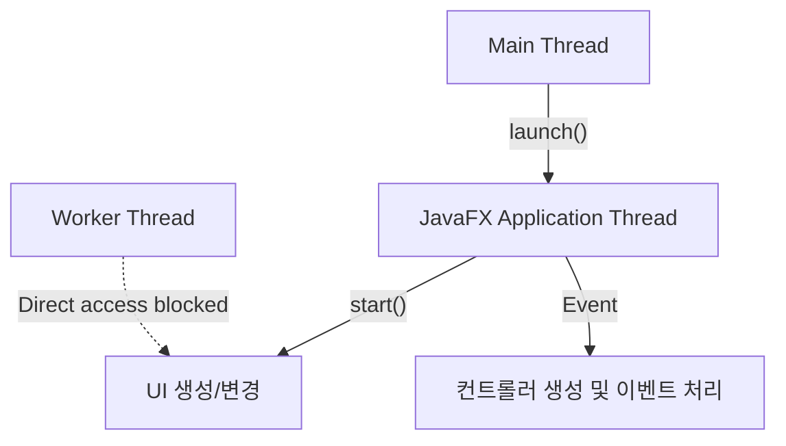

# 11. JavaFX 스레드와 UI 변경

JavaFX UI는 스레드에 안전하지(Thread-safe) 않기 때문에 UI를 생성하고 변경하는 작업은 **JavaFX Application Thread**가 담당해야 합니다. 다른 작업 스레드들은 UI를 직접 생성하거나 변경할 수 없습니다.

`main` 스레드가 `Application`의 `launch()` 메소드를 호출하면서 생성된 JavaFX Application Thread는 `start()` 메소드를 실행시키면서 모든 UI를 생성합니다. 컨트롤에서 이벤트가 발생할 경우 컨트롤러의 이벤트 처리 메소드를 실행하는 것도 JavaFX Application Thread입니다.



## 1. 작업 스레드와 UI 변경

JavaFX 애플리케이션을 개발할 때 주의할 점은 JavaFX Application Thread가 시간을 요하는 작업을 하지 않도록 하는 것입니다. 시간을 요하는 작업을 하게 되면 이 시간 동안 UI는 반응하지 않고 멈춰있는 상태가 되기 때문에, 네트워크 통신이나 파일 입출력 같은 긴 작업은 별도의 작업 스레드를 생성해서 처리해야 합니다.

만약 작업 스레드에서 UI 변경 작업이 필요하다면, **`Platform.runLater()`** 메소드를 사용해야 합니다. 이 메소드는 `Runnable` 객체를 매개값으로 받아 이벤트 큐(Event Queue)에 저장하고, JavaFX Application Thread가 여유가 있을 때 순차적으로 실행하여 UI를 변경합니다.

### Platform.runLater() 사용법

**Runnable 익명 구현 객체 이용**
```java
Platform.runLater(new Runnable() {
    @Override
    public void run() {
        // UI 생성 및 변경 코드
    }
});
```

**람다식 이용**
```java
Platform.runLater(() -> {
    // UI 생성 및 변경 코드
});
```

`Platform.runLater()`는 이벤트 큐에 작업을 등록하고 즉시 리턴되므로, 작업 스레드는 블로킹되지 않고 계속 실행됩니다.

---

## 2. 예제: 디지털 시계

작업 스레드가 0.1초 주기로 시간을 얻어 `Label`을 업데이트하는 예제입니다. `setText()` 메소드는 UI 변경 작업이므로 `Platform.runLater()` 내부에서 호출해야 합니다.

**root.fxml**
```xml
<?xml version="1.0" encoding="UTF-8"?>

<?import javafx.scene.layout.AnchorPane?>
<?import javafx.scene.control.Label?>
<?import javafx.scene.control.Button?>

<AnchorPane xmlns:fx="http://javafx.com/fxml" prefHeight="100.0" prefWidth="200.0"
            fx:controller="sec11.exam01_runlater.RootController">
    <children>
        <Label fx:id="lblTime" alignment="CENTER" layoutX="25.0" layoutY="15.0"
               prefHeight="35.0" prefWidth="150.0"
               style="-fx-background-color: black; -fx-text-fill: yellow; -fx-font-size: 20; -fx-background-radius: 10;"
               text="00:00:00" />
        <Button fx:id="btnStart" layoutX="46.0" layoutY="63.0" text="시작" />
        <Button fx:id="btnStop" layoutX="110.0" layoutY="63.0" text="멈춤" />
    </children>
</AnchorPane>
```

**RootController.java**
```java
package sec11.exam01_runlater;

import java.net.URL;
import java.text.SimpleDateFormat;
import java.util.Date;
import java.util.ResourceBundle;
import javafx.application.Platform;
import javafx.event.ActionEvent;
import javafx.fxml.FXML;
import javafx.fxml.Initializable;
import javafx.scene.control.Button;
import javafx.scene.control.Label;

public class RootController implements Initializable {
    @FXML private Label lblTime;
    @FXML private Button btnStart;
    @FXML private Button btnStop;

    private boolean stop;

    @Override
    public void initialize(URL location, ResourceBundle resources) {
        btnStart.setOnAction(event -> handleBtnStart(event));
        btnStop.setOnAction(event -> handleBtnStop(event));
    }

    public void handleBtnStart(ActionEvent e) {
        stop = false;
        Thread thread = new Thread() {
            @Override
            public void run() {
                SimpleDateFormat sdf = new SimpleDateFormat("HH:mm:ss");
                while(!stop) {
                    String strTime = sdf.format(new Date());
                    // UI 변경 작업은 Platform.runLater()로 처리
                    Platform.runLater(() -> {
                        lblTime.setText(strTime);
                    });
                    try { Thread.sleep(100); } catch (InterruptedException e) {}
                }
            }
        };
        thread.setDaemon(true); // 데몬 스레드로 설정 (애플리케이션 종료 시 자동 종료)
        thread.start();
    }

    public void handleBtnStop(ActionEvent e) {
        stop = true;
    }
}
```

---

## 3. 예제: ProgressBar 업데이트

작업 스레드에서 0부터 100까지 합을 구하는 동안 진행 상태를 `ProgressBar`와 `Label`에 표시하는 예제입니다.

**root.fxml**
```xml
<?xml version="1.0" encoding="UTF-8"?>

<?import javafx.scene.layout.AnchorPane?>
<?import javafx.scene.control.ProgressBar?>
<?import javafx.scene.control.Label?>
<?import javafx.scene.control.Button?>

<AnchorPane xmlns:fx="http://javafx.com/fxml" prefHeight="129.0" prefWidth="233.0"
            fx:controller="sec11.exam02_runlater.RootController">
    <children>
        <ProgressBar fx:id="progressBar" layoutX="17.0" layoutY="23.0"
                     prefWidth="200.0" progress="0.0" />
        <Label layoutX="18.0" layoutY="57.0" text="진행정도:" />
        <Label fx:id="lblWorkDone" layoutX="77.0" layoutY="57.0" />
        <Label layoutX="118.0" layoutY="57.0" text="작업결과:" />
        <Label fx:id="lblResult" layoutX="175.0" layoutY="57.0" />
        <Button fx:id="btnStart" layoutX="66.0" layoutY="91.0" text="시작" />
        <Button fx:id="btnStop" layoutX="130.0" layoutY="91.0" text="멈춤" />
    </children>
</AnchorPane>
```

**RootController.java**
```java
package sec11.exam02_runlater;

import java.net.URL;
import java.util.ResourceBundle;
import javafx.application.Platform;
import javafx.event.ActionEvent;
import javafx.fxml.FXML;
import javafx.fxml.Initializable;
import javafx.scene.control.Button;
import javafx.scene.control.Label;
import javafx.scene.control.ProgressBar;

public class RootController implements Initializable {
    @FXML private ProgressBar progressBar;
    @FXML private Label lblWorkDone;
    @FXML private Label lblResult;
    @FXML private Button btnStart;
    @FXML private Button btnStop;

    private Thread thread;

    @Override
    public void initialize(URL location, ResourceBundle resources) {
        btnStart.setOnAction(event -> handleBtnStart(event));
        btnStop.setOnAction(event -> handleBtnStop(event));
    }

    public void handleBtnStart(ActionEvent e) {
        thread = new Thread() {
            @Override
            public void run() {
                int result = 0;
                for(int i = 0; i <= 100; i++) {
                    result += i;
                    
                    double progress = i / 100.0;
                    String workDone = String.valueOf(i);

                    // 진행 상태 업데이트
                    Platform.runLater(() -> {
                        progressBar.setProgress(progress);
                        lblWorkDone.setText(workDone);
                    });

                    try { Thread.sleep(100); } catch(InterruptedException e) {
                        break;
                    }
                }
                
                String strResult = String.valueOf(result);

                // 결과 출력 업데이트
                Platform.runLater(() -> {
                    lblResult.setText(strResult);
                });
            }
        };
        thread.setDaemon(true);
        thread.start();
    }

    public void handleBtnStop(ActionEvent e) {
        if (thread != null) {
            thread.interrupt();
        }
    }
}
```


