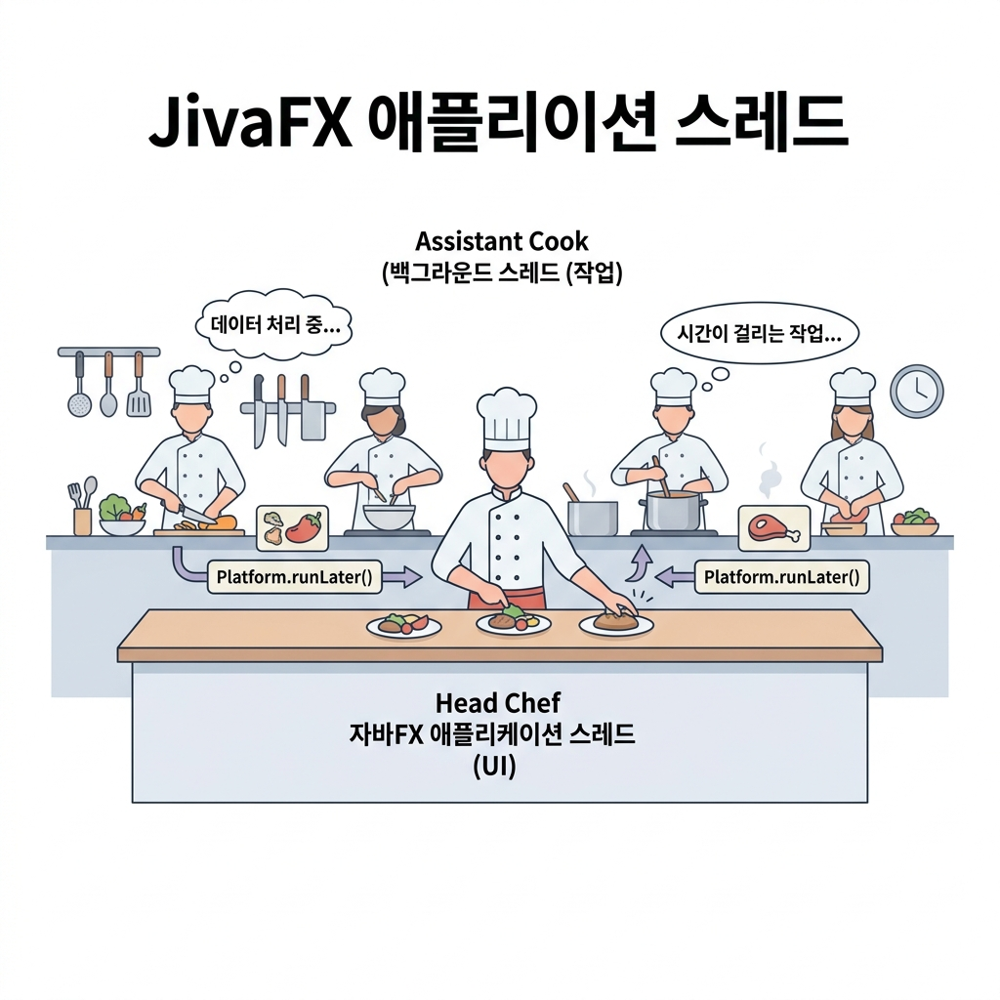

# 11. JavaFX 스레드와 UI 변경 (Application Thread)

여러 프로그램 동작이 부딪히는 멀티스레드 환경에서, UI 컴포넌트가 꼬이거나 충돌 나지 않게 관리하는 자바 GUI의 대원칙 **단일 스레드 모델(Single-threaded Model)**과 **`Platform.runLater()`**의 구조를 격파해 봅시다! ⚙️

---

## 1. JavaFX 스레드 모델과 대원칙

자바 JavaFX의 모든 UI 컴포넌트(버튼, 라벨, 창 등)는 내부적으로 **스레드 안전(Thread-safe)하지 않습니다.** 여러 일꾼(작업 스레드)이 동시에 하나의 라벨 글씨를 바꾸려 하면 글씨가 찌그러지거나 프로그램이 뻗어버릴 수 있습니다.

> **⚠️ JavaFX 스레드 대원칙: 오직 단 하나만 화면을 그릴 수 있다!**
> 화면을 띄우고, 버튼을 누르고, 크기를 조절하는 모든 그래픽 제어 작업은 자바가 특별 지정한 **"JavaFX Application Thread (UI 전용 스레드)"** 혼자서만 수행해야 합니다. 일반 작업 스레드(Worker Thread)가 UI 값을 직접 수정(`label.setText` 등)하면 런타임 예외와 함께 경고가 발생합니다.

### 💡 주방과 헤드 셰프 비유로 배우는 스레드 통신
* **JavaFX Application Thread (주방의 헤드 셰프) 👨‍🍳**: 
  - 오직 이 사람만이 손님에게 나갈 접시(화면 UI)에 데코레이션을 얹고 완성해서 내보낼 권한을 가집니다.
* **Worker Thread (백스테이지의 보조 요리사들) 🧑‍🍳**: 
  - 무거운 식재료를 손질하거나(네트워크 다운로드, 파일 읽기 등) 시간이 오래 걸리는 밑작업을 담당합니다. 접시에 직접 손을 댈 수는 없습니다.
* **`Platform.runLater()` (준비 완료 접시 전달대) 📥**: 
  - 보조 요리사가 재료 준비를 마치면, 헤드 셰프에게 **"재료 준비 완료되었습니다. 시간 나실 때 이 재료를 접시에 얹어주세요!"** 하고 전달대에 조심스럽게 놓아둡니다. 헤드 셰프는 자기 일(이벤트 큐)을 처리하다 여유가 생기면 전달대의 음식을 안전하게 접시에 얹어 완성합니다.



---

## 2. 작업 스레드에서 안전하게 UI를 바꾸는 방법: `Platform.runLater()`

보조 요리사(작업 스레드)가 네트워크나 파일 연산을 수행하다가 중간 결과를 화면에 업데이트하고 싶다면, 반드시 `Platform.runLater()` 괄호 안에 UI 변경 코드를 감싸서 호출해야 합니다.

### 📄 기본 사용 예시 (람다식)
```java
// 작업 스레드 내부에서 실행되는 구문
Thread thread = new Thread(() -> {
    // 1. 시간이 10초 넘게 걸리는 고된 연산 수행 (보조 요리사 작업)
    int result = performHeavyCalculation(); 
    
    // 2. 연산이 끝나고 화면 라벨의 글씨를 바꾸려 할 때 (Platform.runLater로 위임!)
    Platform.runLater(() -> {
        // 이 괄호 안의 코드는 헤드 셰프(UI 스레드)가 시간 날 때 와서 안전하게 그려줍니다.
        lblResult.setText("계산 완료: " + result); 
    });
});
thread.setDaemon(true);
thread.start();
```

---

## 3. 실습 예제: 실시간 디지털 시계 (Digital Clock)

0.1초 주기로 현재 시간을 구해 라벨에 찍어주는 작업 스레드 시계 프로그램입니다. 시간 텍스트를 변경하는 코드(`setText`)가 `Platform.runLater()`로 묶인 점에 주목하세요!

### 📄 실습 예제 FXML (`root.fxml`)
```xml
<?xml version="1.0" encoding="UTF-8"?>
<?import javafx.scene.layout.AnchorPane?>
<?import javafx.scene.control.Label?>
<?import javafx.scene.control.Button?>

<AnchorPane prefHeight="100.0" prefWidth="200.0" 
            fx:controller="sec11.exam01_runlater.RootController"
            xmlns:fx="http://javafx.com/fxml">
    <children>
        <Label fx:id="lblTime" alignment="CENTER" layoutX="25.0" layoutY="15.0"
               prefHeight="35.0" prefWidth="150.0" text="00:00:00"
               style="-fx-background-color: black; -fx-text-fill: yellow; -fx-font-size: 20; -fx-background-radius: 10;" />
        <Button fx:id="btnStart" layoutX="40.0" layoutY="60.0" text="시작" />
        <Button fx:id="btnStop" layoutX="110.0" layoutY="60.0" text="멈춤" />
    </children>
</AnchorPane>
```

### 🧠 실습 예제 컨트롤러 (`RootController.java`)
```java
package sec11.exam01_runlater;

import java.net.URL;
import java.text.SimpleDateFormat;
import java.util.Date;
import java.util.ResourceBundle;
import javafx.application.Platform;
import javafx.event.ActionEvent;
import javafx.fxml.FXML;
import javafx.fxml.Initializable;
import javafx.scene.control.Button;
import javafx.scene.control.Label;

public class RootController implements Initializable {
    @FXML private Label lblTime;
    @FXML private Button btnStart;
    @FXML private Button btnStop;

    private boolean stop; // 스레드 중지 플래그

    @Override
    public void initialize(URL location, ResourceBundle resources) {
        btnStart.setOnAction(event -> handleBtnStart(event));
        btnStop.setOnAction(event -> handleBtnStop(event));
    }

    private void handleBtnStart(ActionEvent e) {
        stop = false;
        Thread thread = new Thread(() -> {
            SimpleDateFormat sdf = new SimpleDateFormat("HH:mm:ss");
            while (!stop) {
                String strTime = sdf.format(new Date());
                
                // ⚠️ 아주 중요: UI 변경은 반드시 Platform.runLater()로 감쌉니다!
                Platform.runLater(() -> lblTime.setText(strTime));
                
                try {
                    Thread.sleep(100); // 0.1초 대기
                } catch (InterruptedException ex) {
                    break;
                }
            }
        });
        thread.setDaemon(true); // 프로그램 종료 시 동반 종료되도록 데몬 스레드로 설정
        thread.start();
    }

    private void handleBtnStop(ActionEvent e) {
        stop = true;
    }
}
```

---

## 🔤 코딩 영단어 학습

자바 GUI 동시성(Concurrency) 제어를 위한 필수 영단어를 익힙니다.

* **Thread-safe (스레드 세이프)**
  * **뜻**: 멀티스레드 안전성
  * **설명**: 여러 개의 스레드 일꾼들이 동시에 한 변수나 자원을 낚아채 사용해도 값의 왜곡이나 오작동이 일어나지 않도록 보호 조치된 성질을 말합니다.
* **Application Thread (애플리케이션 스레드)**
  * **뜻**: 메인 실행 스레드, UI 전담 스레드
  * **설명**: JavaFX 런타임에서 화면을 렌더링하고, 이벤트를 전달하는 메인 그래픽 셰프 스레드입니다.
* **Worker Thread (워커 스레드)**
  * **뜻**: 일꾼 스레드, 백그라운드 작업 스레드
  * **설명**: 메인 화면이 프리징(먹통)되지 않도록 무겁고 긴 연산(네트워크 통신, 압축 해제 등)을 등 뒤에서 묵묵히 전담해 주는 서브 작업 스레드를 뜻합니다.
* **Daemon (데몬)**
  * **뜻**: 수호신, 뒤에서 보살피는 일꾼
  * **설명**: 메인 스레드가 완전히 퇴장해 종료될 때, 스스로 돌아가던 작업을 멈추고 함께 목숨을 끊어 메모리를 청소하는 착한 백그라운드 도우미 스레드 옵션입니다.
