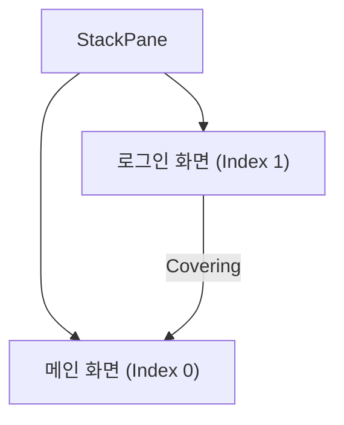

# 12. 장면 이동과 애니메이션

애플리케이션은 다양한 화면을 가지고 있습니다. 메인 화면에서 시작해 사용자의 선택에 따라 가입 화면, 로그인 화면, 목록 화면 등으로 이동됩니다. 화면이 이동될 때 애니메이션을 적용하면 눈을 즐겁게 만들어줍니다.

## 1. 화면 이동 (Scene Transition)

JavaFX에서 화면은 `Scene`이므로, 화면을 이동한다는 것은 `Scene`을 변경하는 것입니다.
`Stage`에 새로운 `Scene`을 세팅하면 되지만, 이 경우 이전 장면이 제거되므로 애니메이션을 적용하기 어렵습니다.

따라서 애니메이션 효과를 주며 화면을 전환하려면, **루트 컨테이너(예: `StackPane`)는 그대로 두고, 그 안의 자식 노드들을 교체하거나 겹쳐서 보여주는 방식**을 사용합니다.

### StackPane을 이용한 화면 전환 원리
1. `StackPane`을 루트 컨테이너로 사용합니다.
2. 메인 화면 위에 로그인 화면을 추가(`add`)하면, 로그인 화면이 보이고 메인 화면은 뒤로 가려집니다.
3. 로그인 화면을 제거(`remove`)하면, 다시 메인 화면이 보입니다.
4. 이 과정에서 좌표 이동이나 투명도 조절 등을 통해 애니메이션 효과를 낼 수 있습니다.

**StackPane 구조**


### 예제: StackPane을 이용한 화면 전환

**root.fxml (메인 화면 포함)**
```xml
<?xml version="1.0" encoding="UTF-8"?>

<?import javafx.scene.layout.StackPane?>
<?import javafx.scene.layout.BorderPane?>
<?import javafx.scene.layout.VBox?>
<?import javafx.scene.control.Label?>
<?import javafx.scene.control.Button?>
<?import javafx.geometry.Insets?>

<StackPane xmlns:fx="http://javafx.com/fxml"
           prefHeight="500" prefWidth="350"
           fx:controller="sec12.exam01_stackpane.RootController">
    <children>
        <BorderPane>
            <top>
                <BorderPane style="-fx-background-color: #eaeaea;">
                    <center>
                        <Label alignment="CENTER" prefWidth="215" text="메인 화면" />
                    </center>
                    <right>
                        <Button fx:id="btnLogin" text="로그인"/>
                    </right>
                    <padding>
                        <Insets bottom="10.0" left="10.0" right="10.0" top="10.0" />
                    </padding>
                </BorderPane>
            </top>
            <center>
                <VBox style="-fx-background-color: #0000ff;" />
            </center>
        </BorderPane>
    </children>
</StackPane>
```

**login.fxml (로그인 화면)**
```xml
<?xml version="1.0" encoding="UTF-8"?>

<?import javafx.scene.layout.BorderPane?>
<?import javafx.scene.layout.VBox?>
<?import javafx.scene.control.Label?>
<?import javafx.scene.control.Button?>
<?import javafx.geometry.Insets?>

<BorderPane xmlns:fx="http://javafx.com/fxml"
            fx:id="login" prefHeight="500" prefWidth="350"
            fx:controller="sec12.exam01_stackpane.LoginController">
    <top>
        <BorderPane style="-fx-background-color: #eaeaea;">
            <left>
                <Button fx:id="btnMain" text="메인"/>
            </left>
            <center>
                <Label alignment="CENTER" prefWidth="215" text="로그인 화면" />
            </center>
            <padding>
                <Insets bottom="10.0" left="10.0" right="10.0" top="10.0" />
            </padding>
        </BorderPane>
    </top>
    <center>
        <VBox style="-fx-background-color: #ffff00;" />
    </center>
</BorderPane>
```

**RootController.java (로그인 화면 띄우기)**
```java
public void handleBtnLogin(ActionEvent event) {
    try {
        Parent login = FXMLLoader.load(getClass().getResource("login.fxml"));
        StackPane root = (StackPane) btnLogin.getScene().getRoot();
        root.getChildren().add(login); // 로그인 화면 추가
    } catch(Exception e) {
        e.printStackTrace();
    }
}
```

**LoginController.java (로그인 화면 닫기)**
```java
public void handleBtnMain(ActionEvent event) {
    try {
        StackPane root = (StackPane) btnMain.getScene().getRoot();
        root.getChildren().remove(login); // 로그인 화면 제거
    } catch (Exception e) {
        e.printStackTrace();
    }
}
```

---

## 2. 애니메이션 (Animation)

JavaFX에서 애니메이션은 컨트롤 또는 컨테이너의 속성(Property) 변화를 주어진 시간 동안 진행함으로써 구현합니다.

### 주요 애니메이션 클래스
| 클래스       | 설명                                                    |
| :----------- | :------------------------------------------------------ |
| **KeyValue** | 값이 변경될 타겟 Property와 종료값을 설정하는 객체      |
| **KeyFrame** | 애니메이션의 지속 시간과 KeyValue를 설정하는 객체       |
| **Timeline** | KeyFrame에 설정된 내용대로 애니메이션을 플레이하는 객체 |

### 슬라이드 애니메이션 구현 예시
컨테이너의 `translateX` 속성을 변경하여 수평으로 슬라이드하는 코드입니다.

```java
// 1. Timeline 객체 생성
Timeline timeline = new Timeline();

// 2. KeyValue 생성 (타겟 속성, 종료값)
KeyValue keyValue = new KeyValue(container.translateXProperty(), 0); 

// 3. KeyFrame 생성 (지속시간, KeyValue)
KeyFrame keyFrame = new KeyFrame(Duration.millis(100), keyValue);

// 4. Timeline에 KeyFrame 추가
timeline.getKeyFrames().add(keyFrame);

// 5. 애니메이션 시작
timeline.play();
```

### 적용: 로그인 화면 슬라이드
로그인 화면이 나타날 때 오른쪽에서 왼쪽으로, 사라질 때 왼쪽에서 오른쪽으로 슬라이드되도록 수정합니다.

**RootController.java (나타날 때)**
```java
public void handleBtnLogin(ActionEvent event) {
    try {
        Parent login = FXMLLoader.load(getClass().getResource("login.fxml"));
        StackPane root = (StackPane) btnLogin.getScene().getRoot();
        root.getChildren().add(login);
        
        // 초기 위치 설정 (화면 오른쪽 밖)
        login.setTranslateX(350); 
        
        // 애니메이션 설정 (0으로 이동)
        Timeline timeline = new Timeline();
        KeyValue keyValue = new KeyValue(login.translateXProperty(), 0);
        KeyFrame keyFrame = new KeyFrame(Duration.millis(100), keyValue);
        timeline.getKeyFrames().add(keyFrame);
        timeline.play();
    } catch(Exception e) {
        e.printStackTrace();
    }
}
```

**LoginController.java (사라질 때)**
```java
public void handleBtnMain(ActionEvent event) {
    try {
        StackPane root = (StackPane) btnMain.getScene().getRoot();
        
        // 애니메이션 설정 (다시 오른쪽 밖으로 이동)
        Timeline timeline = new Timeline();
        KeyValue keyValue = new KeyValue(login.translateXProperty(), 350);
        KeyFrame keyFrame = new KeyFrame(
            Duration.millis(100),
            new EventHandler<ActionEvent>() {
                @Override
                public void handle(ActionEvent event) {
                    // 애니메이션 종료 후 제거
                    root.getChildren().remove(login);
                }
            },
            keyValue
        );
        timeline.getKeyFrames().add(keyFrame);
        timeline.play();
    } catch (Exception e) {
        e.printStackTrace();
    }
}
```


