# Chapter 15. 자바 기본 API (java.base)

> **"자바 프로그래밍의 기초 공구 세트"**

 

## 학습목표

1.  **java.base 모듈**: 자바의 가장 기본이 되는 모듈과 패키지를 이해합니다.
2.  **Object 클래스**: 자바의 모든 클래스의 조상인 Object의 주요 메소드(`equals`, `toString` 등)를 익힙니다.
3.  **유용한 클래스들**: `String`, `Wrapper`, `Math`, `Date/Time` 등 자주 사용하는 도구들을 배웁니다.

---

 

## 목차

### [15.1 API 도큐먼트](./01/)
방대한 자바 라이브러리 설명서(API Document)를 보는 법을 배웁니다.

### [15.2 java.base 모듈](./02/)
모든 자바 프로그램의 기초가 되는 `java.base` 모듈을 알아봅니다.

### [15.3 Object 클래스](./object)
모든 클래스의 최상위 부모, `Object` 클래스의 핵심 기능을 배웁니다.

### [15.4 System 클래스](./system)
운영체제(OS)와 소통하는 `System` 클래스(`out`, `in`, `exit`)를 배웁니다.

### [15.5 문자열 클래스 (String)](./string)
문자열을 다루는 `String`, `StringBuilder`, `StringTokenizer`를 배웁니다.

### [15.6 포장 클래스 (Wrapper)](./wrapper)
기본 타입(`int`, `double`)을 객체로 감싸는 `Integer`, `Double` 등을 배웁니다.

### [15.7 수학 클래스 (Math)](./math)
수학 계산을 돕는 `Math` 클래스와 난수 생성 `Random`을 배웁니다.

### [15.8 날짜와 시간 클래스](./date-time)
날짜와 시간을 다루는 `Date`, `Calendar`, `LocalDateTime`을 배웁니다.

### [15.9 형식 클래스 (Format)](./format)
숫자와 날짜를 예쁘게 출력하는 `DecimalFormat`, `SimpleDateFormat`을 배웁니다.

### [15.10 정규 표현식 (Regex)](./regex)
문자열의 패턴(이메일, 전화번호 등)을 검사하는 정규 표현식을 배웁니다.

---

 

## 확인문제
- [확인문제](./quiz)
