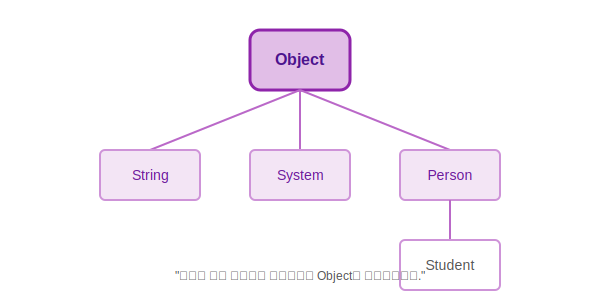

# 15.3 Object 클래스


<br>

## 1. 자바의 단군 할아버지 (The Ancestor) 👴

`java.lang.Object` 클래스는 **자바의 모든 클래스의 최상위 부모**입니다.
여러분이 클래스를 만들 때 `extends`를 쓰지 않아도, 컴파일러가 자동으로 `extends Object`를 붙여줍니다.

마치 **"모든 인간은 DNA를 가지고 있다"**는 것처럼, **"모든 자바 객체는 Object의 기능을 가지고 있다"**라고 이해하면 됩니다.



<br>


<br>

## 2. 주요 유산 (Methods)

`Object` 클래스가 물려주는 가장 중요한 3가지 메소드가 있습니다.

### 1) `equals(Object obj)`: "너랑 나랑 같은 사람?"
*   **기본 동작**: `==` 연산자와 같습니다. (메모리 주소가 같은지 비교)
*   **재정의(Override) 필요**: 사람을 구별할 때 주민등록번호가 같으면 같은 사람으로 보듯이, 객체 내부의 **값(ID, 등)**이 같으면 `true`를 리턴하도록 고쳐서 씁니다. (`String`이 대표적)

### 2) `hashCode()`: "지문 식별 번호"
*   **기본 동작**: 메모리 주소를 기반으로 한 고유 번호를 리턴합니다.
*   **용도**: `HashSet`, `HashMap` 같은 해시 기반 컬렉션에서 객체를 빨리 찾을 때 씁니다.
*   **규칙**: `equals()`가 `true`라면, `hashCode()`도 반드시 같아야 합니다. (같은 사람이면 지문도 같아야 하니까요.)

### 3) `toString()`: "자기 소개"
*   **기본 동작**: `클래스이름@16진수주소` (예: `Person@15db9742`) -> 알아보기 힘듦.
*   **재정의 필요**: 객체의 중요 정보를 문자열로 예쁘게 리턴하도록 고쳐서 씁니다.

<br>


<br>

## 3. 예제: `Member` 클래스 재정의

```java
package ch15.sec03;

public class Member {
    private String id;
    private String name;

    public Member(String id, String name) {
        this.id = id;
        this.name = name;
    }

    // 1. equals 재정의: ID가 같으면 같은 회원이다!
    @Override
    public boolean equals(Object obj) {
        if (obj instanceof Member target) {
            return id.equals(target.id);
        }
        return false;
    }

    // 2. hashCode 재정의: ID가 같으면 같은 번호를 뱉자!
    @Override
    public int hashCode() {
        return id.hashCode();
    }

    // 3. toString 재정의: 내 정보를 예쁘게 출력!
    @Override
    public String toString() {
        return "Member{id=" + id + ", name=" + name + "}";
    }
}
```

<br>


<br>

## 4. Record (보너스 트랙) 💿

Java 14부터는 이런 지루한 코드(Getter, toString, equals, hashCode...)를 자동으로 만들어주는 **`record`** 키워드가 생겼습니다.
**"데이터만 담는 객체(DTO)"**를 만들 때 아주 유용합니다.

```java
// 이 한 줄이 위의 Member 클래스와 거의 똑같습니다! (Setter 제외)
public record Member(String id, String name) {
}
```

```java
Member m = new Member("winter", "한겨울");
System.out.println(m); // Member[id=winter, name=한겨울] (toString 자동 생성됨)
System.out.println(m.id()); // Getter 자동 생성 (이름이 getId()가 아니라 id()임)
```

> **핵심**: `Object`는 모든 클래스의 부모이며, `equals`, `hashCode`, `toString`은 필요에 따라 꼭 **재정의(Override)**해서 써야 합니다.
