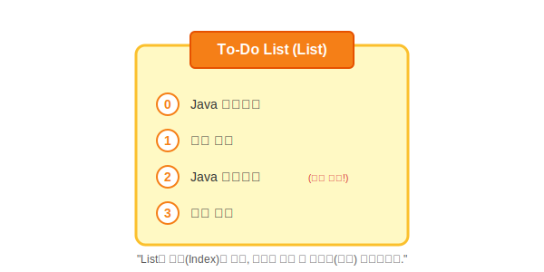

# Chapter 17. 컬렉션 자료구조 (Collection Framework)

> **"효율적인 데이터 정리를 위한 자바의 정리 정돈 도구들"**

 

## 학습목표

1.  **List (순서 O, 중복 O)**: 줄을 서서 기다리는 데이터 관리법을 배웁니다.
2.  **Set (순서 X, 중복 X)**: 유일한 데이터만 모으는 법을 배웁니다.
3.  **Map (키-값)**: 짝을 지어 데이터를 관리하는 법을 배웁니다.
4.  **Tree (정렬)**: 자동으로 순서를 매기며 저장하는 법을 배웁니다.
5.  **LIFO & FIFO**: 스택과 큐의 구조를 이해합니다.

---

 

## 목차

### [17.1 List 컬렉션](./list)
순서가 있고 중복을 허용하는 **"할 일 목록(To-Do List)"** 같은 자료구조입니다. (`ArrayList`, `LinkedList`, `Vector`)

### [17.2 Set 컬렉션](./set)
순서가 없고 중복을 허용하지 않는 **"보석함(Jewelry Box)"** 같은 자료구조입니다. (`HashSet`, `LinkedHashSet`)

### [17.3 Map 컬렉션](./map)
키(Key)와 값(Value)의 쌍으로 저장되는 **"목욕탕 라커(Locker)"** 같은 자료구조입니다. (`HashMap`, `Hashtable`, `Properties`)

### [17.4 검색 기능을 강화시킨 컬렉션](./tree)
저장할 때부터 자동으로 정렬되는 **"도서관 책장"** 같은 자료구조입니다. (`TreeSet`, `TreeMap`)

### [17.5 LIFO와 FIFO 컬렉션](./stack-queue)
나중에 넣은 게 먼저 나오는 **"프링글스 통(Stack)"**과 먼저 줄 선 사람이 먼저 타는 **"버스 줄(Queue)"** 자료구조입니다.

### [17.6 동기화된 컬렉션](./synchronized)
여러 스레드가 동시에 접근해도 안전한 **"1인용 화장실"** 같은 컬렉션을 만드는 방법입니다.

---

 

## 확인문제
- [확인문제](./quiz)
