# 17.3 Map 컬렉션


<br>

## 1. 목욕탕 라커룸 (Locker Room) 🔑

`Map`은 **키(Key)**와 **값(Value)**을 한 쌍으로 묶어서 저장하는 자료구조입니다.
마치 **"목욕탕 라커"**와 같습니다.

1.  **Key = 라커 번호**: 중복될 수 없습니다. (10번 라커가 두 개면 안 되니까요.)
2.  **Value = 라커 속 물건**: 중복되어도 상관없습니다. (10번에도 가방, 11번에도 가방이 들어있을 수 있습니다.)
3.  **덮어쓰기**: 만약 10번 라커에 이미 물건이 있는데, 또 물건을 넣으면? **기존 물건을 빼고 새 물건을 넣습니다.**



<br>


<br>

## 2. 대표적인 Map 친구들

### 1) HashMap: "가장 빠르고 무난한 라커"
*   **특징**: 순서를 보장하지 않습니다. 라커 번호가 뒤죽박죽일 수 있습니다.
*   **장점**: 키(Key)를 알면 값(Value)을 찾는 속도가 엄청 빠릅니다.
*   **비유**: **"해시태그 검색"**. 키워드만 알면 바로 찾습니다.

### 2) Hashtable: "안전 제일 라커"
*   **특징**: `HashMap`과 똑같지만, **동기화(Synchronized)**가 되어 있어 멀티 스레드에서 안전합니다.
*   **주의**: Key나 Value에 **`null`을 넣을 수 없습니다.**

### 3) Properties: "설정 파일 전용 라커"
*   **특징**: Key와 Value가 무조건 **`String`만 가능**합니다.
*   **용도**: 프로그램 설정 파일(`.properties`)을 읽거나 쓸 때 주로 사용합니다.

<br>


<br>

## 3. 사용법 (Put / Get)

`Map`은 `add` 대신 `put`을 씁니다.

```java
Map<String, Integer> map = new HashMap<>();

// 1. 저장 (put)
map.put("홍길동", 90);
map.put("이순신", 100);
map.put("홍길동", 80); // "홍길동" 키 중복! -> 90점 날라가고 80점이 저장됨.

// 2. 읽기 (get)
int score = map.get("이순신"); // 100

// 3. 삭제 (remove)
map.remove("홍길동");

// 4. 전체 읽기 (keySet 활용)
Set<String> keys = map.keySet(); // 키들만 모아서 Set으로 받음
for(String key : keys) {
    System.out.println(key + ": " + map.get(key));
}
```

> **핵심 요약**: **"아이디-비밀번호"**, **"단어-뜻"** 처럼 짝꿍이 있는 데이터는 무조건 **Map**입니다.
