# 17.2 Set 컬렉션


<br>

## 1. 보석함 (Jewelry Box) 💎

`List`가 순서대로 줄을 서는 할 일 목록이라면,
`Set`은 막 집어넣는 **"보석함"**과 같습니다.

1.  **순서가 없다**: "첫 번째 칸에 뭐 있어?"라고 물어볼 수 없습니다. 그냥 섞여 있습니다.
2.  **중복이 안 된다**: 똑같은 다이아몬드 반지가 두 개일 필요는 없습니다. 하나만 있으면 됩니다.



<br>


<br>

## 2. 대표적인 Set 친구들

### 1) HashSet: "가장 빠르고 무난한 보석함"
*   **특징**: 순서를 전혀 보장하지 않습니다. 넣은 순서대로 나올 거라 기대하지 마세요.
*   **장점**: 중복 검사와 데이터 추가/삭제가 엄청나게 빠릅니다.
*   **비유**: **"주머니"**. 손 집어넣어서 잡히는 대로 꺼냅니다.

### 2) LinkedHashSet: "기억력 좋은 보석함"
*   **특징**: `HashSet`인데 **"넣은 순서"**를 기억합니다.
*   **장점**: 중복은 막으면서, 순서대로 데이터를 보고 싶을 때 씁니다.

### 3) TreeSet: "정리 정돈된 보석함"
*   **특징**: 넣자마자 자동으로 **오름차순 정렬(가나다순)**됩니다.
*   **단점**: 정리하느라 `HashSet`보다는 조금 느립니다.

<br>


<br>

## 3. 중복을 어떻게 알까? (`hashCode`와 `equals`)

자바의 `Set`은 아주 꼼꼼합니다. 두 객체가 같은지 확인하기 위해 두 단계 검사를 거칩니다.

1.  **`hashCode()` 확인**: "일단 명찰(해시코드)이 같은가?" -> 다르면 다른 객체!
2.  **`equals()` 확인**: "명찰이 같다면, 진짜 내용물도 같은가?" -> 같아야 비로소 중복!

그래서 내가 만든 클래스(`Member` 등)를 `Set`에 넣으려면, **반드시 `hashCode()`와 `equals()`를 재정의(Override)**해줘야 중복 처리가 제대로 됩니다.

<br>


<br>

## 4. 사용법 (Iterator)

`Set`은 순서(인덱스)가 없어서 `get(0)` 같은 걸 못 씁니다. 대신 **반복자(Iterator)**를 쓰거나 **향상된 for문**을 씁니다.

```java
Set<String> set = new HashSet<>();
set.add("Java");
set.add("Python");
set.add("Java"); // 무시됨 (중복)

// 1. 향상된 for문 (추천)
for (String s : set) {
    System.out.println(s);
}

// 2. 반복자 (Iterator)
Iterator<String> it = set.iterator();
while(it.hasNext()) {
    String s = it.next();
    System.out.println(s);
}
```

> **핵심 요약**: **"중복을 없애고 유니크한 데이터만 남기고 싶을 때"**는 무조건 **Set**입니다.
