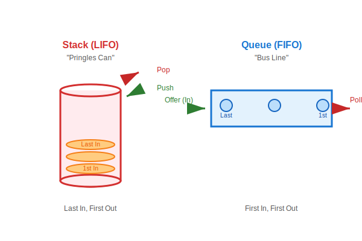

# 17.5 LIFO와 FIFO (Stack & Queue)


<br>

## 1. 프링글스 통 vs 버스 줄 서기 🚌

데이터가 들어오고 나가는 순서가 중요한 경우가 있습니다.
대표적으로 **Stack**과 **Queue**가 있습니다.



### 1) Stack (LIFO: Last In First Out)
*   **비유**: **"프링글스 통"**
*   **특징**: 나중에 넣은 감자칩이 제일 위에 있어서, **나중에 넣은 걸 가장 먼저 먹습니다.**
*   **사용처**: 뒤로 가기 버튼 (가장 최근에 본 페이지로 돌아감), 메소드 호출 스택.

### 2) Queue (FIFO: First In First Out)
*   **비유**: **"버스 정류장 줄 서기"**
*   **특징**: 먼저 줄 선 사람이 **가장 먼저 버스를 탑니다.**
*   **사용처**: 프린터 대기열 (먼저 인쇄 누른 거 먼저 출력), 메시지 큐.

<br>


<br>

## 2. Stack 사용법 (Push / Pop)

자바에서는 `Stack` 클래스를 제공합니다.

```java
Stack<Coin> coinBox = new Stack<>();

// 1. 넣기 (push)
coinBox.push(new Coin(100)); // 1번
coinBox.push(new Coin(500)); // 2번 (제일 위)

// 2. 꺼내기 (pop)
Coin coin = coinBox.pop(); // 500원 (나중에 넣은 게 먼저 나옴)

// 3. 훔쳐보기 (peek)
// 꺼내지는 않고 제일 위에 뭐 있는지만 확인
Coin top = coinBox.peek(); 
```

<br>


<br>

## 3. Queue 사용법 (Offer / Poll)

자바에서 `Queue`는 인터페이스이고, 구현체로 주로 `LinkedList`를 사용합니다.

```java
Queue<Message> messageQueue = new LinkedList<>();

// 1. 넣기 (offer)
messageQueue.offer(new Message("홍길동")); // 1번
messageQueue.offer(new Message("이순신")); // 2번
---

# 17.5 LIFO와 FIFO (Stack & Queue)


<br>

## 1. 프링글스 통 vs 버스 줄 서기 🚌

데이터가 들어오고 나가는 순서가 중요한 경우가 있습니다.
대표적으로 **Stack**과 **Queue**가 있습니다.


### 1) Stack (LIFO: Last In First Out)
*   **비유**: **"프링글스 통"**
*   **특징**: 나중에 넣은 감자칩이 제일 위에 있어서, **나중에 넣은 걸 가장 먼저 먹습니다.**
*   **사용처**: 뒤로 가기 버튼 (가장 최근에 본 페이지로 돌아감), 메소드 호출 스택.

### 2) Queue (FIFO: First In First Out)
*   **비유**: **"버스 정류장 줄 서기"**
*   **특징**: 먼저 줄 선 사람이 **가장 먼저 버스를 탑니다.**
*   **사용처**: 프린터 대기열 (먼저 인쇄 누른 거 먼저 출력), 메시지 큐.

<br>


<br>

## 2. Stack 사용법 (Push / Pop)

자바에서는 `Stack` 클래스를 제공합니다.

```java
Stack<Coin> coinBox = new Stack<>();

// 1. 넣기 (push)
coinBox.push(new Coin(100)); // 1번
coinBox.push(new Coin(500)); // 2번 (제일 위)

// 2. 꺼내기 (pop)
Coin coin = coinBox.pop(); // 500원 (나중에 넣은 게 먼저 나옴)

// 3. 훔쳐보기 (peek)
// 꺼내지는 않고 제일 위에 뭐 있는지만 확인
Coin top = coinBox.peek(); 
```

<br>


<br>

## 3. Queue 사용법 (Offer / Poll)

자바에서 `Queue`는 인터페이스이고, 구현체로 주로 `LinkedList`를 사용합니다.

```java
Queue<Message> messageQueue = new LinkedList<>();

// 1. 넣기 (offer)
messageQueue.offer(new Message("홍길동")); // 1번
messageQueue.offer(new Message("이순신")); // 2번

// 2. 꺼내기 (poll)
Message msg = messageQueue.poll(); // "홍길동" (먼저 넣은 게 먼저 나옴)
```

> **핵심 요약**
> *   **Stack**: **"후입선출"** (나중에 온 놈이 대장)
> *   **Queue**: **"선입선출"** (먼저 온 사람이 임자)

---

## 코딩 영단어 학습 📝

코딩에서 영어 단어의 의미만 정확히 이해해도 절반은 성공입니다! 오늘 배운 핵심 영단어들을 다시 한번 짚고 넘어가 볼까요?

*   **`Stack`**: 스택, 무더기. (프링글스 통처럼 밑이 막혀있어 나중에 집어넣은 데이터(Last In)를 가장 먼저 꺼내게(First Out) 되는 구조. LIFO)
*   **`Queue`**: 큐, 대기줄. (버스 정류장 줄서기처럼 통로가 시원하게 뚫려있어 먼저 들어온 데이터(First In)가 먼저 나가는(First Out) 구조. FIFO)
*   **`Push` / `Pop`**: 푸시 / 팝. (스택 통 안에 데이터를 꾹꾹 밀어 넣는 행동(Push)과 뿅 하고 제일 위의 데이터를 뽑아내는 행동(Pop))
*   **`Offer` / `Poll`**: 오퍼 / 폴. (큐 줄서기에 사람을 밀어 넣는 행동(Offer)과 맨 앞사람을 버스에 태워 줄에서 빼내는 행동(Poll))
