# 17.4 검색 기능을 강화시킨 컬렉션 (Tree)


<br>

## 1. 도서관 책장 (Bookshelf) 📚

일반 `Set`이나 `Map`은 데이터를 막 집어넣지만, **Tree** 계열은 넣을 때부터 **순서를 맞춰서** 정리합니다.
마치 **"도서관 책장"**과 같습니다.

1.  **자동 정렬**: 책을 아무렇게나 꽂는 게 아니라, '가나다' 순이나 '번호' 순으로 제자리에 꽂습니다.
2.  **빠른 검색**: "50번 책 어딨어?"라고 하면 1번부터 다 찾는 게 아니라, 중간쯤 펴보고 "아, 더 뒤에 있겠네" 하며 금방 찾습니다. (이진 탐색 트리)



<br>


<br>

## 2. 대표적인 Tree 친구들

### 1) TreeSet: "정렬된 보석함"
*   **특징**: `Set`인데 오름차순으로 정렬됩니다. `[10, 5, 8]`을 넣으면 `[5, 8, 10]`으로 저장됩니다.
*   **기능**:
    *   `first()`: 제일 작은 거 (최소값)
    *   `last()`: 제일 큰 거 (최대값)
    *   `lower(95)`: 95 바로 아래 점수
    *   `higher(95)`: 95 바로 위 점수

### 2) TreeMap: "정렬된 라커룸"
*   **특징**: `Map`인데 **키(Key)**를 기준으로 정렬됩니다.

<br>


<br>

## 3. 정렬 기준은 누가 정하나? (Comparable vs Comparator)

책을 꽂을 때 "제목 순"으로 할지 "지은이 순"으로 할지 정해야겠죠?

1.  **Comparable (기본 규칙)**:
    *   "나는 원래 나이 순으로 줄 서요."
    *   `Person(나)` 클래스 안에 `compareTo(Person 남)` 메소드를 구현해서, 내가 쟤보다 큰지 작은지 알려줍니다.

2.  **Comparator (특수 규칙)**:
    *   "이번만 특별히 이름 순으로 서보자."
    *   별도의 심판(`Comparator`)을 데려와서 "얘랑 쟤 중에 누가 먼저야?"라고 물어봅니다.

```java
// 기본은 오름차순 (1, 2, 3...)
TreeSet<Integer> scores = new TreeSet<>();
scores.add(87);
scores.add(98);
scores.add(75);

// 출력하면 75, 87, 98 순서로 나옴
for(Integer s : scores) {
    System.out.println(s);
}

System.out.println("1등 점수: " + scores.last()); // 98
System.out.println("꼴찌 점수: " + scores.first()); // 75
```

> **핵심 요약**: 데이터를 **넣자마자 정렬**하고 싶다거나, **범위 검색(80점 이상인 사람)**을 자주 해야 한다면 **Tree**를 쓰세요.
