# 14.6 사용자 정의 예외 (Custom Exception)


<br>

## 1. 나만의 전용 경보기 🔔

자바에는 `NullPointerException`이나 `IOException` 같은 표준 예외들이 이미 많이 있습니다.
하지만 **"은행 잔고 부족"**이나 **"회원 아이디 중복"** 같은 상황을 표현하는 예외는 없습니다. 이건 내 프로그램만의 특수한 상황이니까요.

이럴 때 만드는 것이 바로 **사용자 정의 예외**입니다.



<br>


<br>

## 2. 만들기 (상속만 받으면 끝)

예외도 클래스입니다. `Exception`을 상속받으면 됩니다.

```java
// "일반 예외"로 만들고 싶다면 Exception 상속 (권장)
public class BalanceInsufficientException extends Exception {
    
    // 기본 생성자
    public BalanceInsufficientException() {
    }

    // 에러 메시지를 받는 생성자 (부모에게 전달)
    public BalanceInsufficientException(String message) {
        super(message);
    }
}
```

<br>


<br>

## 3. 사용하기 (throw)

이제 내가 만든 예외를 필요한 상황에서 터뜨려(`throw`) 봅니다.

### 은행 계좌 클래스
```java
public void withdraw(int money) throws BalanceInsufficientException {
    if (balance < money) {
        // "잔고 부족" 경보를 울림!
        throw new BalanceInsufficientException("잔고가 모자랍니다: " + (money - balance));
    }
    balance -= money;
}
```

### 실행하는 곳
```java
try {
    account.withdraw(50000);
} catch (BalanceInsufficientException e) {
    // 내가 만든 예외를 잡아서 처리
    System.out.println(e.getMessage()); // "잔고가 모자랍니다..."
    System.out.println("대출을 알아보시겠습니까?");
}
```

> **핵심 요약**: 내 프로그램의 비즈니스 로직에 맞는 **명확한 이름의 예외**를 만들면, 코드의 가독성과 유지보수성이 훨씬 좋아집니다.
