# 14.3 예외 종류에 따른 처리 (Multi-catch)


<br>

## 1. 종합 병원 진료 시스템 🏥

병원에는 내과, 외과, 치과 등 전문 분야가 있습니다. 환자(예외)의 증상에 따라 의사가 달라져야 합니다.
자바의 `try-catch`도 마찬가지입니다. 하나의 `try` 블록에서 여러 종류의 예외가 발생할 수 있다면, `catch` 블록을 여러 개 만들어 각각 다르게 처리할 수 있습니다.



<br>


<br>

## 2. 기본 다중 catch

```java
try {
    // 1. 배열 인덱스 초과 가능성
    // 2. 숫자 포맷 오류 가능성
} catch(ArrayIndexOutOfBoundsException e) {
    System.out.println("인덱스 오류! 배열 범위를 확인하세요.");
} catch(NumberFormatException e) {
    System.out.println("숫자 포맷 오류! 숫자만 입력하세요.");
}
```

*   **동작 원리**: 예외가 터지면 위에서부터 순서대로 `catch` 블록을 검사합니다. 맞는 타입이 있으면 실행하고 나머지는 건너뜁니다.
*   **주의**: `catch` 블록 중 **단 하나만** 실행됩니다.

<br>


<br>

## 3. 상속 관계 주의 (순서가 중요!)

모든 예외의 부모인 `Exception` 클래스는 **"모든 병을 고치는 만능 의사(일반의)"**와 같습니다.
만약 `catch(Exception e)`를 맨 위에 작성하면 어떻게 될까요?

```java
// ❌ 잘못된 순서
try { ... } 
catch(Exception e) { ... } // 여기서 다 걸러짐 (모든 예외의 부모니까)
catch(NullPointerException e) { ... } // 여기까지 올 기회가 없음 (Unreachable Code)
```

따라서 **구체적인 자식 예외(전문의)**를 먼저 쓰고, **부모 예외(일반의)**는 맨 마지막에 써야 합니다.

```java
// ✅ 올바른 순서
catch(NullPointerException e) { ... }
catch(NumberFormatException e) { ... }
catch(Exception e) { ... } // 마지막 보루 (나머지 모든 예외 처리)
```

<br>


<br>

## 4. 멀티 catch (파이프 `|`)

Java 7부터는 똑같은 처리를 하는 예외들을 하나로 묶을 수 있습니다.

```java
try { ... } 
catch(NullPointerException | NumberFormatException e) {
    // 두 예외 중 하나가 발생하면 여기서 처리
    System.out.println("데이터에 문제가 있습니다.");
}
```

> **핵심 요약**: 예외 처리는 **"구체적인 것부터, 추상적인 것 순서로"** 작성해야 합니다. `Exception`은 최후의 안전장치(`else`)라고 생각하세요.

---

## 코딩 영단어 학습 📝

코딩에서 영어 단어의 의미만 정확히 이해해도 절반은 성공입니다! 오늘 배운 핵심 영단어들을 다시 한번 짚고 넘어가 볼까요?

*   **`Multi`**: 멀티, 다중의. (여러 가지 서로 다른 예외(증상)들이 터질 것을 대비해, `catch` 블록(응급실)을 여러 개 줄지어 세팅해 두고 각각 알맞은 처방을 내리는 기법)
*   **`Triage`**: 트리아지, 부상자 분류. (응급실에서 환자의 중증도나 증상에 따라 다른 의사에게 보내듯, 예외가 터졌을 때 어떤 `catch` 블록으로 보내야 할지 순서대로 알맞게 걸러내는 과정)
