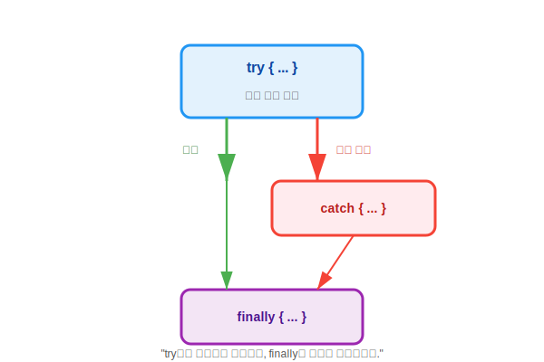

# 14.2 예외 처리 코드 (try-catch-finally)


<br>

## 1. 안전 운전 매뉴얼 🚗

예외 처리는 **"사고가 나도 차를 멈추지 않고 계속 달리게 하는 기술"**입니다.
자바에서는 `try-catch-finally` 블록을 사용해 3단계 안전장치를 만듭니다.



1.  **`try` (시도)**: "일단 운전해봐." (예외가 발생할 수 있는 코드를 넣습니다.)
2.  **`catch` (수습)**: "사고 나면 이렇게 처리해." (예외가 발생했을 때 실행할 코드입니다.)
3.  **`finally` (마무리)**: "사고가 나든 안 나든, 시동은 끄고 내려." (무조건 실행되는 코드입니다.)

<br>


<br>

## 2. 사용법 살펴보기

### 기본 문법
```java
try {
    // 1. 여기서 위험한 짓을 시도함
    int result = 10 / 0; 
} catch(ArithmeticException e) {
    // 2. 사고(0으로 나누기) 발생 시 이곳으로 점프!
    System.out.println("0으로 나눌 수 없습니다!");
} finally {
    // 3. 성공하든 실패하든 무조건 뒷정리
    System.out.println("계산 종료.");
}
```

### 실행 순서
*   **성공 시**: `try` 실행 -> `finally` 실행. (`catch` 건너뜀)
*   **실패 시**: `try` 실행 중단 -> `catch` 실행 -> `finally` 실행.

<br>


<br>

## 3. 예외 정보를 확인하는 3가지 방법

`catch (Exception e)` 블록에서 예외 객체 `e`를 통해 사고 경위를 조사할 수 있습니다.

1.  **이유만 간단히**: `e.getMessage()` -> "Zero division error"
2.  **종류와 이유**: `e.toString()` -> "java.lang.ArithmeticException: / by zero"
3.  **상세 추적(권장)**: `e.printStackTrace()` -> 사고 지점과 경로를 모두 출력해줍니다. 디버깅 때 필수!

> **핵심 요약**: `try`는 시도하고, `catch`는 받아내고, `finally`는 정리합니다. 이 구조만 알면 프로그램이 갑자기 툭 꺼지는 일을 막을 수 있습니다.
