# Chapter 14. 예외 처리 (Exception Handling)

> **"사고(Bug)를 예방하고, 사고가 나도 수습하는 안전장치"**

 

## 학습목표

1.  예외(Exception)와 에러(Error)의 차이를 이해합니다.
2.  **일반 예외(Checked)**와 **실행 예외(Unchecked)**의 종류와 특징을 구별합니다.
3.  `try-catch-finally` 블록을 사용하여 예외를 안전하게 처리하는 방법을 익힙니다.
4.  `try-with-resources`를 통해 리소스를 자동으로 닫는 방법을 배웁니다.
5.  `throws` 키워드로 예외를 떠넘기는 방법과 사용자 정의 예외를 만드는 법을 배웁니다.

---

 

## 목차

### [14.1 예외와 예외 클래스](./exception-class)
프로그램 실행 중 발생하는 오류의 종류와 자바의 예외 클래스 계층 구조를 배웁니다.

### [14.2 예외 처리 코드 (try-catch-finally)](./handling-code)
예외가 발생했을 때 프로그램이 종료되지 않도록 안전하게 처리하는 기본 문법을 배웁니다.

### [14.3 예외 종류에 따른 처리](./handling-by-type)
다양한 예외 상황(숫자 포맷 오류, 널 포인터 등)을 각각 다르게 처리하는 다중 `catch` 기법을 배웁니다.

### [14.4 리소스 자동 닫기 (try-with-resources)](./try-with-resources)
파일이나 네트워크 연결 같은 리소스를 사용 후 자동으로 닫아주는(`close`) 편리한 문법을 배웁니다.

### [14.5 예외 떠넘기기 (throws)](./throws)
메소드 내부에서 발생한 예외를 직접 처리하지 않고, 메소드를 호출한 곳으로 책임을 넘기는 방법을 배웁니다.

### [14.6 사용자 정의 예외](./custom-exception)
자바 표준 예외 외에 내 프로그램에 맞는 커스텀 예외를 만들고 발생시키는 방법을 배웁니다.

---

 

## 확인문제
- [확인문제](./quiz)
