# 14.5 예외 떠넘기기 (throws)


<br>

## 1. 폭탄 돌리기 💣

예외가 발생했을 때 처리하는 방법은 두 가지입니다.
1.  **직접 처리 (`try-catch`)**: 내가 폭탄을 해체한다.
2.  **떠넘기기 (`throws`)**: "나 못해! 팀장님이 알아서 하세요!" 하고 폭탄을 호출한 쪽으로 던진다.



*   `method()`가 폭탄을 던지면 -> 호출한 `caller()`가 받습니다.
*   `caller()`도 던지면 -> `main()`이 받습니다.
*   `main()`마저 던지면 -> **JVM(자바 가상 머신)**이 받아서 프로그램을 **강제 종료(Crash)** 시킵니다.

<br>


<br>

## 2. 사용 방법

메소드 이름 뒤에 `throws 예외클래스`를 적으면 됩니다.

```java
public void findClass() throws ClassNotFoundException {
    // 여기서 예외가 터지면, 나는 처리 안 하고 던질래!
    Class.forName("java.lang.Syring2"); 
}
```

이제 이 메소드를 호출하는 쪽에서는 **반드시** 예외 처리를 해야 합니다(또는 또 던지거나).

```java
public static void main(String[] args) {
    try {
        findClass(); // 폭탄이 날아올 수 있음!
    } catch(ClassNotFoundException e) {
        System.out.println("폭탄 해체 완료!");
    }
}
```

<br>


<br>

## 3. 왜 떠넘길까요?

무책임해 보일 수 있지만, 사실은 **"역할 분담"**입니다.
*   `readFile()` 메소드는 파일을 읽는 기능만 담당합니다.
*   파일이 없을 때 "프로그램을 끌지", "다시 물어볼지", "기본 파일을 쓸지"는 이 메소드를 사용하는 **메인 로직**이 결정해야 합니다.
*   그래서 `readFile()`은 "나 파일 못 찾았어!"라고 보고(`throws`)만 하는 것이 더 좋은 설계일 때가 많습니다.

> **핵심 요약**: `throws`는 예외를 회피하는 것이 아니라, **처리 책임을 호출자에게 위임**하는 것입니다.
