# 14.4 리소스 자동 닫기 (try-with-resources)


<br>

## 1. 호텔 카드키 vs 자동문 🚪

파일이나 네트워크 같은 **리소스(자원)**는 사용이 끝나면 반드시 닫아줘야(`close`) 합니다.
마치 호텔 방을 나갈 때 카드키를 반납해야 하는 것과 같습니다. 그런데 자꾸 까먹거나, 급하게 나가다가(예외 발생) 못 반납하는 경우가 생깁니다.

이 문제를 해결하기 위해 Java 7부터 **자동문(try-with-resources)** 기능이 도입되었습니다.



*   **기존 방식 (`finally`)**: "나갈 때 꼭 불 끄고 가세요." (사람이 해야 함 -> 실수 가능)
*   **새 방식 (`try-with-resources`)**: "나가면 센서가 감지해서 자동으로 불을 끕니다." (기계가 함 -> 안전)

<br>


<br>

## 2. 사용 방법

`try` 옆에 괄호 `()`를 열고, 닫아야 할 객체를 생성하면 됩니다.

### 기존 방식 (복잡함)
```java
FileInputStream fis = null;
try {
    fis = new FileInputStream("file.txt");
    // ... 파일 읽기 ...
} catch (IOException e) {
    // 예외 처리
} finally {
    // 여기가 문제! close 하다가 또 예외 날 수도 있음. 코드가 엄청 길어짐.
    if (fis != null) { 
        try { fis.close(); } catch (IOException e) { } 
    }
}
```

### try-with-resources 방식 (깔끔함)
```java
// 괄호 안에 객체 생성 코드를 넣습니다.
try (FileInputStream fis = new FileInputStream("file.txt")) {
    
    // ... 파일 읽기 ...

} catch (IOException e) {
    // 예외 처리
} 
// (알아서 fis.close()가 호출됨)
```

<br>


<br>

## 3. 조건: AutoCloseable 인터페이스

이 기능이 작동하려면 해당 클래스가 **`AutoCloseable`**이라는 인터페이스를 구현하고 있어야 합니다.
(자바의 대부분의 입출력 클래스는 이미 구현되어 있습니다.)

```java
public class MyResource implements AutoCloseable {
    @Override
    public void close() throws Exception {
        System.out.println("자동으로 닫혔습니다!");
    }
}
```

> **핵심 요약**: 파일, DB, 네트워크 등을 다룰 때는 반드시 **`try-with-resources`**를 쓰세요. 코드가 절반으로 줄어들고, 안전성은 2배가 됩니다.
