# 7.10 추상 클래스 (미완성 설계도)

일반 클래스가 '완성된 설계도'라면, **추상 클래스(Abstract Class)는 '실체가 없는 미완성 설계도'**입니다.
이 클래스만으로는 객체(제품)를 만들 수 없고, 반드시 자식 클래스가 상속받아 완성시켜야 합니다.

### 💡 핵심 비유: 프랜차이즈 본사 레시피
> **"본사(추상 클래스)가 기본 레시피는 주지만, '비법 소스(추상 메소드)'는 각 지점(자식 클래스)이 알아서 만들어야 한다!"**
>
> 1.  **본사(Abstract Class)**: 가게를 낼 수는 없지만, 가이드라인을 제공함.
> 2.  **지점(Child Class)**: 본사의 가이드를 따르되, 빈 칸(비법 소스)을 반드시 채워야 오픈 가능.


---

## 1. 추상 클래스란?

*   **`abstract` 키워드**: 클래스 앞에 붙이면 "이건 미완성입니다"라는 뜻입니다.
*   **객체 생성 불가**: `new Animal()` 처럼 직접 실체(인스턴스)를 만들 수 없습니다. (미완성이니까요!)
*   **용도**: 자식 클래스들의 **공통점(필드, 메소드)을 통일**하고, **규격(설계)**을 강제하는 역할을 합니다.


```java
// "나는 실체가 없다.. 자식이 완성해 줘.."
public abstract class Animal {
    public String kind;

    public void breathe() {
        System.out.println("숨을 쉽니다.");
    }
}
```

---

## 2. 추상 메소드 (숙제 내주기)

추상 클래스 안에는 **실행 내용(`{}`)이 없는 추상 메소드**를 만들 수 있습니다.
이것은 자식 클래스에게 **"이 기능은 네가 알아서 반드시 만들어야 해!"**라고 강제로 시키는 것과 같습니다.



```java
public abstract class Animal {
    // 1. 일반 메소드 (물려주기만 함 -> 자식이 그대로 써도 됨)
    public void breathe() { 
        System.out.println("숨을 쉽니다."); 
    }

    // 2. 추상 메소드 (내용 없음 -> 자식이 반드시 채워야 함)
    // "소리는 동물마다 다르니까, 자식이 직접 구현해라!"
    public abstract void sound(); 
}
```

### 상속받은 자식의 의무 (숙제 해결)

자식 클래스는 추상 메소드를 **반드시 재정의(Overriding)**해서 내용을 채워야 합니다.
그렇지 않으면 자식 클래스도 컴파일 에러가 나서 생성될 수 없습니다.

```java
public class Dog extends Animal {
    // 부모가 숙제로 낸 sound()를 반드시 해결해야 함
    @Override
    public void sound() {
        System.out.println("멍멍");
    }
}

public class Cat extends Animal {
    @Override
    public void sound() {
        System.out.println("야옹");
    }
}
```

---

## 3. 왜 이렇게 귀찮게 할까요?

그냥 일반 클래스로 만들고 오버라이딩하면 되지 않을까요?
왜 굳이 `abstract`를 써서 강제할까요?

> **"실수를 방지하기 위해서입니다!"**

만약 `sound()`를 일반 메소드로 비워뒀다면, 실수로 자식 클래스에서 오버라이딩을 안 해도 에러가 안 납니다.
그러면 강아지 객체가 소리를 못 내는 버그가 생기겠죠?
**추상 메소드로 만들면, 개발자가 까먹고 구현을 안 했을 때 빨간 줄(에러)을 띄워줍니다.**

---

## 4. 실습 예제

**Animal.java (본사지침)**
```java
public abstract class Animal {
    public String owner;

    public Animal(String owner) {
        this.owner = owner;
    }

    public void breathe() {
        System.out.println("숨을 쉽니다.");
    }

    // 추상 메소드: 자식이 반드시 구현해야 함
    public abstract void sound();
}
```

**Main.java (실행)**
```java
public class Main {
    public static void main(String[] args) {
        // Animal a = new Animal("홍길동"); // ❌ 에러! (미완성이라 생성 불가)
        
        // 1. 강아지 생성
        Dog dog = new Dog("철수");
        dog.sound();   // "멍멍" (자식이 구현한 내용)
        dog.breathe(); // "숨을 쉽니다" (부모가 물려준 내용)

        // 2. 다형성 활용 (부모 타입 변수에 자식 대입)
        Animal myPet = new Cat("영희");
        myPet.sound(); // "야옹" (실제 객체인 고양이 소리)
    }
}
```
