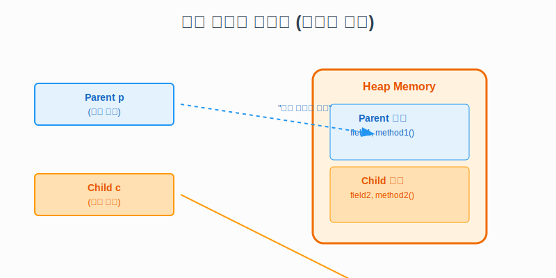

# 7.7 타입 변환 (Casting)

타입 변환이란 변수의 타입을 다른 타입으로 바꾸는 것을 말합니다.
상속 관계에 있는 클래스 사이에서도 타입 변환이 가능합니다.

### 💡 핵심 비유: 역할 놀이 (Role Playing)
> **"학생은 사람이지만, 모든 사람이 학생은 아니다."**
> 1.  **자동 변환 (Upcasting)**: 학생이 '사람' 역할을 하는 것. (자연스러움)
> 2.  **강제 변환 (Downcasting)**: 사람보고 '학생' 역할을 하라고 시키는 것. (원래 학생이었던 사람만 가능!)

---

## 1. 자동 타입 변환 (Upcasting)

자식은 부모의 모든 특징을 물려받았습니다.
그래서 **'자식은 부모다'**라는 말이 성립합니다.
자식 객체를 부모 타입 변수에 대입할 때는 **아무런 조치 없이 자동으로** 변환됩니다.



```java
// 고양이(자식)를 생성해서 동물(부모) 변수에 대입
Cat cat = new Cat();
Animal animal = cat; // 자동 타입 변환 (OK)
```

### 특징
*   부모 타입으로 변환되면, **부모 클래스에 있는 멤버(필드, 메소드)만 보입니다.**
*   자식 클래스에서 추가한 기능(예: `meow()`)은 가려져서 보이지 않습니다.
*   **단, 오버라이딩된 메소드는 자식의 것이 실행됩니다!** (중요: 다형성의 핵심)

<br>
<br>

---

## 2. 강제 타입 변환 (Downcasting)

부모 타입으로 변환된 객체를 **다시 자식 타입으로 되돌리는 것**입니다.
이때는 자동으로 안 되고, **"내가 책임 질게!"**라고 괄호`( )`를 써서 강제로 변환해야 합니다.



```java
// 동물 변수에 들어있는 게 고양이가 맞다면
Animal animal = new Cat(); 

// 다시 고양이로 변환! (강제)
Cat cat = (Cat) animal;
cat.meow(); // 이제 다시 야옹 할 수 있다!
```

### 🔍 메모리 구조로 이해하기 (Deep Dive)
타입 변환이 일어난다고 해서 객체 자체가 바뀌는 것은 아닙니다.
**"객체를 바라보는 시야(Scope)"**가 달라지는 것입니다.



*   `new Child()`로 생성된 객체는 메모리에 `Parent` 영역과 `Child` 영역을 모두 가지고 있습니다.
*   `Parent` 타입 변수는 **부모 영역**까지만 볼 수 있습니다.
*   `Child` 타입 변수는 **자식 영역**까지 모두 볼 수 있습니다.

<br>
<br>

---

## 3. 심화: 주의사항 및 활용

### ⚠️ ClassCastException (변환 오류)
강제 타입 변환은 위험합니다. 만약 실체가 '강아지'인데 억지로 '고양이'로 바꾸려 하면 에러가 납니다.


```java
Animal animal = new Dog(); // 실체는 강아지

// "너 고양이 해!" (불가능)
Cat cat = (Cat) animal; // ❌ 실행 시 에러 발생! (ClassCastException)
```

이런 오류를 막기 위해, 변환하기 전에 **`instanceof`** 연산자로 확인하는 것이 좋습니다.

### ❓ 왜 이렇게 변환을 하나요?
**"여러 종류의 객체를 하나로 묶어서 관리하기 위해서"**입니다.

예를 들어 동물원을 관리하는 프로그램이 있다고 해봅시다.
사자, 호랑이, 곰은 모두 다른 클래스이지만 `Animal`이라는 부모 클래스로 묶을 수 있습니다.

```java
// 다형성을 이용한 관리
Animal[] zoo = {
    new Lion(),
    new Tiger(),
    new Bear()
};

for (Animal animal : zoo) {
    animal.sound(); // 각자 다른 소리를 냄 (오버라이딩)
}
```
이렇게 **부모 타입 하나로 여러 자식 객체를 관리**할 수 있는 것이 상속과 타입 변환의 가장 큰 장점입니다.

<br>
<br>

---

## 4. 예제 코드: 원리와 동작

**Parent.java**
```java
public class Parent {
    public void field1() { System.out.println("부모 필드"); }
}
```

**Child.java**
```java
public class Child extends Parent {
    public void field2() { System.out.println("자식 필드"); }
}
```

**Main.java**
```java
public class Main {
    public static void main(String[] args) {
        // 1. 객체 생성
        Child child = new Child();
        
        // 2. 자동 타입 변환 (Upcasting)
        Parent parent = child;
        parent.field1(); // 가능
        // parent.field2(); // ❌ 불가능 (부모 눈에는 안 보임)

        // 3. 강제 타입 변환 (Downcasting)
        Child child2 = (Child) parent;
        child2.field2(); // ✅ 다시 가능 (자식 눈에는 보임)
    }
}
```
