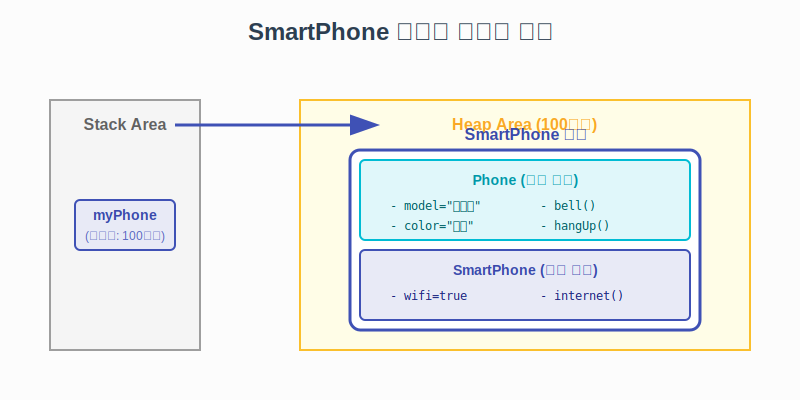

# 7.2 클래스 상속 실습 (스마트폰 만들기)

이번에는 실제 코드로 상속을 체험해 봅시다.
(구형) **일반 전화기**를 상속받아, 기능이 추가된 (신형) **스마트폰**을 만들어 보는 예제입니다.

### 💡 핵심 비유: 기능 업그레이드
> **"피처폰(Phone)에 와이파이 기능을 붙이면 스마트폰(SmartPhone)이 된다!"**


---

## 1. 부모 클래스: Phone (일반 전화기)

먼저 기본적인 전화 기능만 있는 `Phone` 클래스를 만듭니다.
이것이 **부모 클래스**가 됩니다.

**예시 코드 (Phone.java)**
```java
public class Phone {
    // 필드 (속성)
    public String model;
    public String color;

    // 메소드 (기능)
    public void bell() {
        System.out.println("따르릉~ 벨이 울립니다.");
    }

    public void sendVoice(String message) {
        System.out.println("나: " + message);
    }

    public void receiveVoice(String message) {
        System.out.println("상대방: " + message);
    }

    public void hangUp() {
        System.out.println("전화를 끊습니다.");
    }
}
```

<br>
<br>

---

## 2. 자식 클래스: SmartPhone (스마트폰)

이제 `Phone`을 상속받는 `SmartPhone`을 만듭니다.
`extends Phone`이라고 적는 순간, `Phone`의 모든 기능(벨, 통화 등)은 자동으로 `SmartPhone`의 것이 됩니다.
우리는 **새로운 기능(와이파이, 인터넷)**만 추가하면 됩니다.

**예시 코드 (SmartPhone.java)**
```java
public class SmartPhone extends Phone {
    // [추가된 필드]
    public boolean wifi;

    // [생성자]
    public SmartPhone(String model, String color) {
        // 부모 필드(model, color)를 마치 내 것처럼 사용
        this.model = model; 
        this.color = color; 
    }

    // [추가된 메소드]
    public void setWifi(boolean wifi) {
        this.wifi = wifi;
        System.out.println("와이파이 상태를 변경했습니다.");
    }

    public void internet() {
        System.out.println("인터넷에 연결합니다.");
    }
}
```

<br>
<br>

---

## 3. 심화: 메모리 구조 확인 (Deep Dive)

자식인 `SmartPhone` 객체를 만들었을 때, 메모리에서는 어떤 일이 벌어질까요?

> **"자식 객체 안에 부모 객체가 포함되어 생성됩니다."**



1.  `new SmartPhone()`을 호출하면 Heap 영역에 객체가 하나 생성됩니다.
2.  이 객체 내부에는 **부모인 `Phone`의 영역(model, color, bell...)**이 먼저 자리 잡습니다.
3.  그 다음 **자식인 `SmartPhone`의 영역(wifi, internet...)**이 추가됩니다.
4.  외부에서는 이 전체를 하나의 `SmartPhone` 객체로 취급합니다.

<br>
<br>

---

## 4. 예제 코드: 실행 및 결과

**SmartPhoneExample.java**
```java
public class SmartPhoneExample {
    public static void main(String[] args) {
        // SmartPhone 객체 생성
        SmartPhone myPhone = new SmartPhone("갤럭시", "은색");

        // 1. Phone(부모)으로부터 물려받은 기능
        System.out.println("모델: " + myPhone.model);
        System.out.println("색상: " + myPhone.color);
        
        myPhone.bell();
        myPhone.sendVoice("여보세요?");
        myPhone.receiveVoice("안녕하세요! 홍길동입니다.");
        myPhone.hangUp();

        // 2. SmartPhone(자식)만의 추가 기능
        myPhone.setWifi(true);
        myPhone.internet();
    }
}
```

### 실행 결과
```text
모델: 갤럭시
색상: 은색
따르릉~ 벨이 울립니다.
나: 여보세요?
상대방: 안녕하세요! 홍길동입니다.
전화를 끊습니다.
와이파이 상태를 변경했습니다.
인터넷에 연결합니다.
```

> **결론**: 상속을 사용하면, `Phone`의 코드를 다시 작성하지 않고도 `SmartPhone`이라는 새로운 클래스를 **빠르고 효율적으로** 만들 수 있습니다.

<br>
<br>

---

## 🚫 주의: 다중 상속 금지
자바에서는 **부모가 여러 명일 수 없습니다.**
(예: `class Child extends Father, Mother` ❌)

만약 여러 기능이 필요하다면, 나중에 배울 **인터페이스(Interface)**를 사용해야 합니다.
