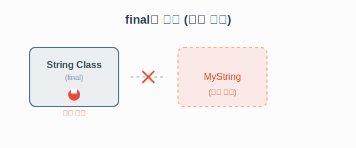

# 7.5 final 키워드 (상속 및 변경 금지)

`final`은 "이게 최종이다(마지막이다!)"라는 뜻입니다.
더 이상 바꿀 수 없다는 의미를 가지며, 클래스와 메소드에 붙였을 때 각각 다른 효과를 냅니다.

### 💡 핵심 비유: 박제된 문서 / 불임 시술
> **"박제된 문서는 수정할 수 없고(오버라이딩 불가), 자손을 남길 수도 없다(상속 불가)."**



---

## 1. final 클래스: "자식을 가질 수 없음"

클래스 앞에 `final`을 붙이면 **상속을 할 수 없는 클래스**가 됩니다.
대표적으로 자바의 `String` 클래스가 `final`로 선언되어 있습니다.

```java
// "나는 자식을 낳지 않겠다!"
public final class Member { 
}

// ❌ 컴파일 에러! Member는 final이라서 상속 불가
// public class VIP extends Member { } 
```

> **왜 쓸까요? (Technical Detail)**
> `String` 클래스처럼 시스템 전반에서 중요하게 쓰이는 핵심 클래스를 누군가 마음대로 상속받아 기능을 변조하면 보안상 큰 문제가 생길 수 있습니다.
> 이를 원천적으로 차단하기 위해 `final`을 사용합니다.

<br>
<br>

---

## 2. final 메소드: "오버라이딩(수정) 금지"

메소드 앞에 `final`을 붙이면 **자식 클래스가 이 메소드를 수정(오버라이딩)할 수 없습니다.**
부모가 정해준 로직을 **"절대 바꾸지 말고 그대로 써라"**고 강제할 때 사용합니다.

```java
public class Car {
    public int speed;

    public void speedUp() { speed += 1; }

    // "이 메소드는 절대 고치지 마! (안전장치)"
    public final void stop() {
        System.out.println("차를 멈춥니다.");
        speed = 0;
    }
}

public class SportsCar extends Car {
    @Override
    public void speedUp() { speed += 10; } // 가능

    // ❌ 에러! stop()은 final이라서 오버라이딩 불가
    /*
    @Override
    public void stop() { 
        System.out.println("스포츠카 멈춤"); 
    }
    */
}
```

<br>
<br>

---

## 요약

| 종류             | 선언 위치               | 의미                     | 비유               |
| :--------------- | :---------------------- | :----------------------- | :----------------- |
| **final 필드**   | `final int a = 10;`     | 값 변경 불가 (상수)      | "박제된 숫자"      |
| **final 클래스** | `public final class A`  | 상속 불가 (자식 생성 X)  | "자녀 계획 없음"   |
| **final 메소드** | `public final void b()` | 오버라이딩 불가 (수정 X) | "최종 확정된 규칙" |
