# Chapter 10. 상속 (Inheritance)

> **"부모의 것을 내 것처럼 물려받아 새로운 것을 창조한다."**

## 학습목표

1.  상속의 개념과 필요성을 이해하고, 자바에서 상속을 구현하는 방법을 익힙니다.
2.  메소드 재정의(Overriding), 자동/강제 타입 변환, 다형성(Polymorphism)의 원리를 파악합니다.
3.  추상 클래스와 추상 메소드의 용도를 이해하고, 실무에서의 활용법을 배웁니다.

---

## 목차

### [7.1 상속 개념](./inheritance)
부모 클래스의 필드와 메소드를 자식 클래스가 그대로 물려받아 사용하는 개념(Inheritance)을 배웁니다. 코드 중복을 줄이고 유지보수성을 높이는 상속의 장점을 이해합니다.

### [7.2 클래스 상속 실습](./class-inheritance)
실제 코드로 `Phone`을 상속받아 `SmartPhone`을 만드는 과정을 실습합니다. `extends` 키워드의 사용법과 자식 객체 생성 시 메모리 구조를 파악합니다.

### [7.3 부모 생성자 호출 (super)](./super-constructor)
자식 객체가 생성될 때 부모 객체가 먼저 생성되는 원리와, 생략된 `super()` 코드의 역할에 대해 배웁니다.

### [7.4 메소드 재정의 (Overriding)](./method-overriding)
부모에게 물려받은 메소드를 자식 클래스에 맞게 수정하여 사용하는 방법(Overriding)을 배웁니다. 실수 방지를 위한 `@Override` 어노테이션도 다룹니다.

### [7.5 final 키워드](./final)
더 이상 상속하거나 수정할 수 없도록 막는 `final` 키워드(클래스, 메소드)의 역할을 알아봅니다.

### [7.6 protected 접근 제한자](./protected)
같은 패키지 혹은 자식 클래스에게만 접근을 허용하는 `protected`의 독특한 접근 범위를 배웁니다.

### [7.7 타입 변환 (Casting)](./casting)
자식 객체가 부모 타입으로 자동 변환되는 업캐스팅(Upcasting)과, 다시 자식 타입으로 되돌리는 다운캐스팅(Downcasting)을 배웁니다.

### [7.8 다형성 (Polymorphism)](./polymorphism)
하나의 객체가 여러 가지 타입을 가질 수 있는 다형성의 개념을 자동차 타이어 교체 예시를 통해 이해합니다.

### [7.9 객체 타입 확인 (instanceof)](./instanceof)
안전한 타입 변환을 위해 객체의 실제 타입을 확인하는 `instanceof` 연산자의 사용법을 배웁니다.

### [7.10 추상 클래스](./abstract-class)
미완성 메소드를 포함하여 자식 클래스에게 구현을 강제하는 추상 클래스(Abstract Class)의 역할과 필요성을 배웁니다.

### [7.11 봉인된 클래스](./sealed-class)
무분별한 상속을 제한하기 위해 Java 15부터 도입된 `sealed` 클래스의 개념을 알아봅니다.

---

## 확인문제
- [확인문제](./quiz)
