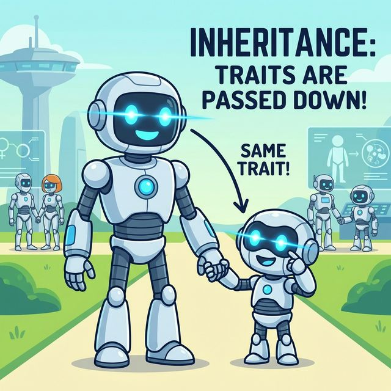
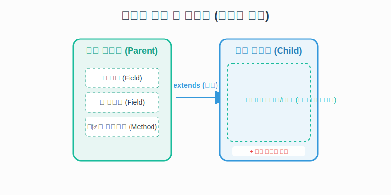
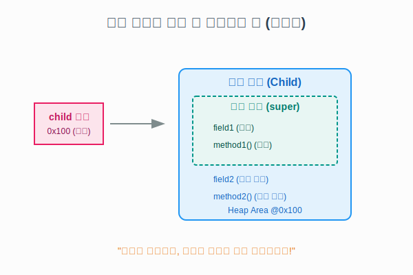

# 7.1 상속 개념 (부모의 것을 내 것처럼)

상속(Inheritance)이란 부모가 자식에게 재산을 물려주는 것과 같습니다. 프로그래밍에서는 **부모 클래스가 가진 필드(데이터)와 메소드(기능)를 자식 클래스가 그대로 물려받아 사용하는 것**을 말합니다.

### 💡 비유: 유전자 상속
부모님으로부터 눈, 코, 입 생김새를 물려받듯이, 자식 클래스는 부모 클래스의 기능을 그대로 물려받습니다. 여기에 더해 자신만의 특징을 추가할 수도 있습니다.




## 1. 상속을 왜 할까요? (Why)

1.  **코드 중복을 줄여줍니다**: 똑같은 코드를 여러 번 칠 필요 없이, 부모에 있는 걸 가져다 쓰면 됩니다.
2.  **유지보수가 쉽습니다**: 부모 클래스 하나만 고치면, 이를 상속받은 수많은 자식 클래스들이 동시에 수정되는 효과가 있습니다.
3.  **확장이 용이합니다**: 기존 기능을 토대로 새로운 기능을 덧붙여 만들기 쉽습니다.

## 2. 상속 선언 방법

현실에서는 부모가 자식을 선택하지만, 자바에서는 **자식이 부모를 선택**합니다.
`extends`(확장하다)라는 키워드를 사용합니다.

```java
// B(자식)는 A(부모)의 기능을 물려받겠다!
public class B extends A { 
    // A의 필드와 메소드는 안 적어도 이미 내 것임
    
    // B만의 새로운 기능만 추가하면 됨
    String newSkill;
}
```

## 3. 상속의 메모리 구조 (중요)

`new B()`를 통해 자식 객체를 생성하면 메모리에는 어떤 일이 벌어질까요?
놀랍게도 **자식 객체 안에 부모 객체가 함께 생성**됩니다.



*   `child` 변수는 힙 영역에 생성된 **자식 객체**를 가리킵니다.
*   그 자식 객체 내부에는 **부모 영역(super)**이 존재하여 부모의 필드와 메소드를 저장하고 있습니다.
*   그래서 우리는 마치 내 것처럼 부모의 기능을 사용할 수 있는 것입니다.

## 4. 실제 코드 예시

**부모 클래스 (Phone.java)**
```java
public class Phone {
    public String model;
    public String color;

    public void bell() {
        System.out.println("벨이 울립니다.");
    }
}
```

**자식 클래스 (SmartPhone.java)**
```java
// SmartPhone은 Phone의 기능을 모두 물려받음
public class SmartPhone extends Phone {
    public boolean wifi;
    
    public void internet() {
        System.out.println("인터넷 연결!");
    }
}
```

**사용 (Main.java)**
```java
SmartPhone myPhone = new SmartPhone();

// 1. 부모(Phone)에게 물려받은 기능 사용 가능
myPhone.model = "Galaxy";
myPhone.bell(); 
---

# 7.1 상속 개념 (부모의 것을 내 것처럼)

상속(Inheritance)이란 부모가 자식에게 재산을 물려주는 것과 같습니다. 프로그래밍에서는 **부모 클래스가 가진 필드(데이터)와 메소드(기능)를 자식 클래스가 그대로 물려받아 사용하는 것**을 말합니다.

### 💡 비유: 유전자 상속
부모님으로부터 눈, 코, 입 생김새를 물려받듯이, 자식 클래스는 부모 클래스의 기능을 그대로 물려받습니다. 여기에 더해 자신만의 특징을 추가할 수도 있습니다.


## 1. 상속을 왜 할까요? (Why)

1.  **코드 중복을 줄여줍니다**: 똑같은 코드를 여러 번 칠 필요 없이, 부모에 있는 걸 가져다 쓰면 됩니다.
2.  **유지보수가 쉽습니다**: 부모 클래스 하나만 고치면, 이를 상속받은 수많은 자식 클래스들이 동시에 수정되는 효과가 있습니다.
3.  **확장이 용이합니다**: 기존 기능을 토대로 새로운 기능을 덧붙여 만들기 쉽습니다.

## 2. 상속 선언 방법

현실에서는 부모가 자식을 선택하지만, 자바에서는 **자식이 부모를 선택**합니다.
`extends`(확장하다)라는 키워드를 사용합니다.

```java
// B(자식)는 A(부모)의 기능을 물려받겠다!
public class B extends A { 
    // A의 필드와 메소드는 안 적어도 이미 내 것임
    
    // B만의 새로운 기능만 추가하면 됨
    String newSkill;
}
```

## 3. 상속의 메모리 구조 (중요)

`new B()`를 통해 자식 객체를 생성하면 메모리에는 어떤 일이 벌어질까요?
놀랍게도 **자식 객체 안에 부모 객체가 함께 생성**됩니다.


*   `child` 변수는 힙 영역에 생성된 **자식 객체**를 가리킵니다.
*   그 자식 객체 내부에는 **부모 영역(super)**이 존재하여 부모의 필드와 메소드를 저장하고 있습니다.
*   그래서 우리는 마치 내 것처럼 부모의 기능을 사용할 수 있는 것입니다.

## 4. 실제 코드 예시

**부모 클래스 (Phone.java)**
```java
public class Phone {
    public String model;
    public String color;

    public void bell() {
        System.out.println("벨이 울립니다.");
    }
}
```

**자식 클래스 (SmartPhone.java)**
```java
// SmartPhone은 Phone의 기능을 모두 물려받음
public class SmartPhone extends Phone {
    public boolean wifi;
    
    public void internet() {
        System.out.println("인터넷 연결!");
    }
}
```

**사용 (Main.java)**
```java
SmartPhone myPhone = new SmartPhone();

// 1. 부모(Phone)에게 물려받은 기능 사용 가능
myPhone.model = "Galaxy";
myPhone.bell(); 

// 2. 자신(SmartPhone)의 기능도 사용 가능
myPhone.wifi = true;
myPhone.internet();
```

> **주의**: 자바는 **다중 상속을 허용하지 않습니다.**
> 아버지가 두 명일 수 없듯이, `extends` 뒤에는 오직 하나의 부모 클래스만 올 수 있습니다.
> `class Child extends Father, Mother { } // (X) 불가능`

---

## 코딩 영단어 학습 📝

코딩에서 영어 단어의 의미만 정확히 이해해도 절반은 성공입니다! 오늘 배운 핵심 영단어들을 다시 한번 짚고 넘어가 볼까요?

*   **`Inherit`**: 인헤릿, 상속받다. (부모 클래스의 재산을 자식 클래스가 복사해 오듯 그대로 물려받는 행위나 개념)
*   **`Parent / Child`**: 패런트 / 차일드. (코딩에서 상속 관계를 나타내는 '부모 클래스(상위)'와 '자식 클래스(하위)'를 영문으로 흔히 부르는 명칭)
