# 7.4 메소드 오버라이딩 (덮어쓰기)

부모에게 물려받은 기능(메소드)이 마음에 들지 않거나, 나에게 맞게 고쳐 써야 할 때가 있습니다.
이때 상속받은 메소드를 자식 클래스에서 다시 작성하는 것을 **메소드 오버라이딩 (Method Overriding)**이라고 합니다.

### 💡 핵심 비유: 레시피 수정
> **"어머니에게 물려받은 '김치찌개 레시피'에 치즈를 추가해서 '치즈 김치찌개'로 만드는 것!"**



---

## 1. 오버라이딩 규칙

오버라이딩은 부모의 메소드를 **완전히 덮어쓰는 것**이므로 규칙이 까다롭습니다.
1.  **똑같이 베껴야 함**: 메소드 이름, 리턴 타입, 매개변수까지 부모 것과 똑같아야 합니다.
2.  **접근을 막으면 안 됨**: 부모가 `public`으로 공개한 것을 자식이 `private`으로 숨길 수 없습니다. (더 넓은 접근 범위는 가능)

> **@Override 어노테이션**
> 메소드 위에 `@Override`라고 붙여주면, 컴파일러가 "이거 오버라이딩 제대로 했는지 검사해 줘!"라고 요청하는 것입니다. 오타나 실수로 오버라이딩이 안 되는 것을 방지해 줍니다.

---

## 2. 예제: 계산기 업그레이드

부모 계산기(`Calculator`)는 원주율을 `3.14159`로 계산하지만,
자식 컴퓨터(`Computer`)는 더 정밀한 `Math.PI`를 사용하여 계산 방식을 변경해 봅시다.

**부모 (Calculator.java)**
```java
public class Calculator {
    public double areaCircle(double r) {
        System.out.println("계산기 실행");
        return 3.14159 * r * r; // 조금 부정확
    }
}
```

**자식 (Computer.java)**
```java
public class Computer extends Calculator {
    
    // 부모의 areaCircle을 내가 다시 만들겠다!
    @Override 
    public double areaCircle(double r) {
        System.out.println("컴퓨터 실행");
        return Math.PI * r * r; // 훨씬 정밀함
    }
}
```

---

## 3. 심화: 어떻게 동작할까? (Deep Dive)

우리가 `new Computer()`를 만들고 `areaCircle()`을 호출하면, 자바는 어떻게 **부모의 것이 아닌 자식의 것**을 실행할까요?



객체는 내부적으로 자신이 사용할 메소드들의 주소록(Map)을 가지고 있습니다.
*   **오버라이딩 전**: 자식의 주소록이 부모의 `calculate()`를 가리킵니다.
*   **오버라이딩 후**: 자식의 주소록이 **새로 만든 `calculate()`**를 가리키도록 업데이트됩니다.
*   따라서 호출하는 사람은 "계산해줘"라고 똑같이 말하지만, 실제로는 **새로운 기능**이 연결되어 실행됩니다. (동적 바인딩)

<br>
<br>

---

## 4. super 키워드 (부모님의 도움)

오버라이딩을 하면 부모의 원래 메소드는 숨겨져서 안 보입니다.
하지만 가끔은 **"부모님이 하던 거 먼저 하고, 그 뒤에 내가 추가 작업을 하고 싶은데?"** 할 때가 있습니다.
이때 사용하는 것이 바로 `super`입니다.

```java
public void fly() {
    if (flyMode == SUPERSONIC) {
        System.out.println("초음속 비행!!"); 
    } else {
        // "평소에는 부모님의 비행 방식을 따르겠습니다."
        super.fly(); 
    }
}
```

*   `super.fly()`: 부모(Airplane)의 `fly()` 메소드를 호출합니다.
*   이렇게 하면 코드를 중복해서 다시 짤 필요 없이, 부모의 기능을 재활용할 수 있습니다.
