# 7.6 protected 접근 제한자

`protected`는 자바의 접근 제한자 중 가장 독특한 녀석입니다.
`public`(모두 환영)보다는 좁고, `default`(같은 패키지만)보다는 넓습니다.

### 💡 핵심 비유: 우리 동네 + 멀리 사는 자식
> **"우리 동네 사람(같은 패키지)은 다 쓸 수 있고, 다른 동네로 이사 간 자식(상속받은 클래스)에게도 물려줄 수 있다."**



---

## 1. 접근 범위

| 접근 제한자   | 같은 클래스 | 같은 패키지 | **자식 클래스** | 그 외 (외부) |
| :------------ | :---------: | :---------: | :-------------: | :----------: |
| public        |      O      |      O      |        O        |      O       |
| **protected** |    **O**    |    **O**    |      **O**      |      X       |
| default       |      O      |      O      |        X        |      X       |
| private       |      O      |      X      |        X        |      X       |

> **핵심**: `protected`는 기본적으로 같은 패키지에서만 접근 가능하지만, **'상속' 관계라면 패키지가 달라도 접근을 허용**해 줍니다.

<br>
<br>

---

## 2. 예제 코드: 다른 패키지의 자식 클래스

**패키지 A: 부모 클래스**
```java
package packageA;

public class Parent {
    // protected 필드
    protected String field;

    // protected 생성자
    protected Parent() {}

    // protected 메소드
    protected void method() {}
}
```

**패키지 B: 자식 클래스**
```java
package packageB;

import packageA.Parent;

public class Child extends Parent { // Parent 상속
    public void childMethod() {
        // 패키지가 다르지만, 상속받았으므로 접근 가능!
        this.field = "value";
        this.method();
    }
}
```

**패키지 B: 남남인 클래스**
```java
package packageB;

import packageA.Parent;

public class Stranger {
    public void method() {
        // 상속받지 않았으므로 접근 불가 (에러!)
        // Parent p = new Parent(); 
        // p.field = "value";
    }
}
```

<br>
<br>

---

## 요약
`protected`는 **"상속을 위한 배려"**가 담긴 접근 제한자입니다.
자식에게는 물려주고 싶지만, 아무나 쓰게 하고 싶지는 않을 때 사용합니다.
