# 7.11 봉인된 클래스 (Sealed Class)

`final` 클래스는 상속을 아예 금지합니다.
하지만 가끔은 **"특정 친구들에게만 상속을 허락하고 싶을 때"**가 있습니다.
Java 15부터 도입된 **Sealed Class**가 바로 그 역할을 합니다.

### 💡 핵심 비유: VIP 전용 멤버십
> **"아무나 가입할 수 없다. 초대받은 사람(Listed)만 들어올 수 있다!"**



---

## 1. 사용 방법 (`permits`)

`sealed` 키워드로 봉인을 선언하고, `permits` 뒤에 상속을 허락할 자식 클래스들을 나열합니다.

```java
// "Employee와 Manager만 나를 상속받을 수 있어!"
public sealed class Person permits Employee, Manager {
    public String name;
}
```

### 상속받은 자식의 의무
봉인된 클래스를 상속받은 자식 클래스(`Employee`, `Manager`)는 반드시 다음 3가지 중 하나를 선택해야 합니다.

1.  **`final`**: 더 이상 상속 불가 (대 끊기)
2.  **`sealed`**: 나도 또 다른 특정 자식에게만 허용 (반복)
3.  **`non-sealed`**: 봉인 해제! 이제부터 누구나 상속 가능 (개방)

```java
// 1. final: 상속 끝
public final class Employee extends Person { ... }

// 3. non-sealed: 봉인 해제 (자유롭게 상속 가능해짐)
public non-sealed class Manager extends Person { ... }
```

---

## 2. 왜 쓸까요? (Deep Dive)

일반적인 상속은 너무 열려있습니다. 내가 라이브러리를 만들었는데, 사용자가 내 의도와 다르게 무분별하게 상속해서 기능을 망가뜨릴 수 있습니다.
반대로 `final`은 너무 닫혀있어서 확장이 불가능합니다.

**Sealed Class는 그 중간 지점을 제공합니다.**
*   라이브러리 작성자가 **"상속 가능한 범위를 명확히 통제"**할 수 있습니다.
*   패턴 매칭(Switch문 등)에서 모든 경우의 수를 컴파일러가 알 수 있어 **안전성**이 높아집니다.

```java
// 컴파일러는 Person의 자식이 Employee, Manager 뿐이라는 걸 안다! (non-sealed 제외 시)
// 따라서 default 케이스가 없어도 안전하다.
```

<br>
<br>

---

## 3. 예제 코드

**Person.java**
```java
public sealed class Person permits Student, Teacher {
    public String name;
}
```

**Student.java**
```java
public final class Student extends Person { // 더 이상 상속 불가
    public void study() { System.out.println("공부"); }
}
```

**Teacher.java**
```java
public non-sealed class Teacher extends Person { // 이제부터 상속 허용
    public void teach() { System.out.println("가르침"); }
}
```

**Professor.java**
```java
// Teacher는 non-sealed라서 상속 가능!
public class Professor extends Teacher { 
}
```

> **결론**: 무분별한 상속을 막고, **계층 구조를 엄격하게 관리**하고 싶을 때 Sealed Class를 사용하세요.

---

## 코딩 영단어 학습 📝

코딩에서 영어 단어의 의미만 정확히 이해해도 절반은 성공입니다! 오늘 배운 핵심 영단어들을 다시 한번 짚고 넘어가 볼까요?

*   **`Sealed`**: 실드, 봉인된. (마치 초대장 명단을 미리 적어둔 VIP 파티처럼, 아무나 자기도 상속받겠다고 끼어드는 것을 막고 내가 허락한 특정 클래스만 상속받을 수 있도록 상속 계층을 원천 봉쇄하는 최신 키워드)
*   **`Permits`**: 퍼미츠, 허용하다. (Sealed 클래스 바로 옆에 붙어서, "나는 정확히 이 클래스들에게만 상속을 허락(Permit)하노라!" 하고 허가 명단을 나열할 때 쓰는 단어)
*   **`Non-sealed`**: 논-실드, 봉인 해제된. (부모가 아주 깐깐하게 봉인해서 물려줬지만, "내 대(자식)부터는 귀찮으니 다시 아무나 다 상속받게 다 풀어주겠다!" 라고 선언할 때 쓰는 키워드)
