# 16.3 제한된 타입 파라미터 (<T extends ...>)


<br>

## 1. 아무나 들어올 수 없다! (VIP Only) 🚫

제네릭 `<T>`는 기본적으로 모든 타입(`Object`)을 다 받을 수 있습니다.
하지만 계산기 프로그램을 만드는데 `String`이나 `Dog` 객체가 들어오면 곤란하겠죠?
이때 **"숫자(Number) 종류만 들어와!"**라고 문지기를 세우는 것이 바로 **제한된 타입 파라미터**입니다.



*   **`<T>`**: 개나 소나 다 들어옴. (String, Double, Person...)
*   **`<T extends Number>`**: 오직 `Number`와 그 자식들(`Integer`, `Double`)만 입장 가능.

<br>


<br>

## 2. 선언 방법 (`extends`)

`extends` 키워드를 사용합니다. (인터페이스를 제한할 때도 `implements`가 아니라 `extends`를 씁니다!)

```java
// T는 반드시 Number이거나 그 자식이어야 한다.
public <T extends Number> double add(T t1, T t2) {
    // T가 Number임이 보장되므로, Number의 메소드(doubleValue)를 맘놓고 쓸 수 있다.
    return t1.doubleValue() + t2.doubleValue();
}
```

<br>


<br>

## 3. 사용 예시

```java
// 성공
double sum1 = add(10, 20);      // Integer는 Number의 자식 -> OK
double sum2 = add(3.14, 5.5);   // Double은 Number의 자식 -> OK

// 실패 (컴파일 에러)
double sum3 = add("Hello", "World"); // String은 Number의 자식이 아님 -> Error!
```

> **핵심 요약**: `<T extends 상위타입>`을 쓰면,
> 1.  이상한 타입이 들어오는 것을 막아주고 (안전성)
> 2.  상위 타입의 메소드를 안심하고 사용할 수 있게 해줍니다. (기능성)
