# 16.2 제네릭 메소드


<br>

## 1. 요술 포장 기계 🏭

제네릭은 클래스 전체에 적용할 수도 있지만, **특정 메소드 하나만** 제네릭으로 만들 수도 있습니다.
이것을 **제네릭 메소드**라고 합니다. 마치 들어오는 재료에 따라 자동으로 포장지가 바뀌는 요술 기계와 같습니다.



*   **일반 메소드**: `Box boxing(Object t)` -> 리턴 타입이 고정됨.
*   **제네릭 메소드**: `<T> Box<T> boxing(T t)` -> 들어오는 `T`에 따라 리턴 타입이 `Box<Integer>`, `Box<String>` 등으로 변신함.

<br>


<br>

## 2. 선언 방법

리턴 타입 앞에 **`<T>`**를 붙여주면 됩니다.

```java
//     [타입파라미터] [리턴타입] [메소드명] ( [매개변수] )
public    <T>      Box<T>    boxing   (   T t    ) {
    Box<T> box = new Box<>();
    box.set(t);
    return box;
}
```

<br>


<br>

## 3. 사용 방법 (자동 유추)

메소드를 호출할 때 타입을 명시해도 되지만, 대부분은 컴파일러가 매개변수를 보고 **알아서 추측**합니다.

```java
// 1. 명시적 방법 (잘 안 씀)
Box<Integer> box1 = <Integer>boxing(100);

// 2. 자동 유추 (권장)
// 100을 넣었으니 T는 Integer겠군! -> 리턴은 Box<Integer>가 됨.
Box<Integer> box2 = boxing(100); 

// "Hong"을 넣었으니 T는 String이겠군! -> 리턴은 Box<String>이 됨.
Box<String> box3 = boxing("Hong");
```

> **핵심 요약**: 제네릭 메소드는 **"입력값의 타입에 따라 결과물의 타입도 유연하게 바뀌는"** 아주 똑똑한 메소드입니다.
