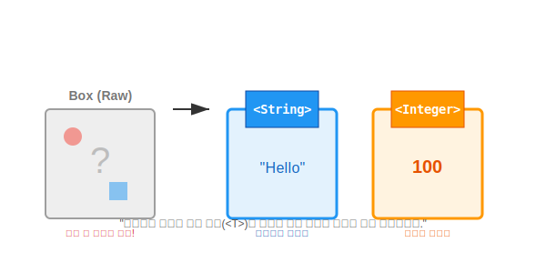

# 16.1 제네릭이란? (Generic Types)


<br>

## 1. 이름표가 없는 상자 vs 있는 상자 📦

자바에서 `Object` 타입은 모든 객체를 담을 수 있는 '만능 상자'입니다.
하지만 이 상자에는 치명적인 단점이 있습니다. 안에 뭐가 들었는지 꺼내보기 전에는 알 수 없고, 꺼낼 때마다 **"이건 사과인가?"하고 확인(형변환)해야 한다**는 점입니다.

제네릭(Generics)은 이 상자에 **`<String>`, `<Integer>` 같은 이름표를 붙이는 기술**입니다.



*   **Non-Generic**: "뭐든지 담는 박스". (꺼낼 때 불안함, 캐스팅 필요)
*   **Generic**: "사과 전용 박스". (사과만 담김, 꺼낼 때 안심)

<br>


<br>

## 2. 제네릭 클래스 선언 (`<T>`)

클래스 이름 뒤에 `<T>`를 붙이면 됩니다. `T`는 Type의 약자입니다.

```java
// 제네릭 클래스 선언
public class Box<T> {
    private T content; // 내용물의 타입이 T가 됨

    public T get() { 
        return content; 
    }
    
    public void set(T content) {
        this.content = content;
    }
}
```

이제 `Box`를 생성할 때 `T`가 무엇인지 알려주면 됩니다.

```java
// 1. 문자열 전용 박스
Box<String> box1 = new Box<>();
box1.set("Hello");
String str = box1.get(); // 형변환 필요 없음!

// 2. 숫자 전용 박스
Box<Integer> box2 = new Box<>();
box2.set(100);
int value = box2.get();  // 형변환 필요 없음!
```

만약 `box1.set(100);`을 시도하면? **컴파일 에러(빨간 줄)**가 뜹니다.
즉, 실행하기도 전에 실수를 잡아줍니다. 이것이 제네릭의 가장 큰 장점인 **"컴파일 시점의 강력한 타입 체크"**입니다.

<br>


<br>

## 3. 멀티 타입 파라미터 (`<K, V>`)

두 개 이상의 이름표가 필요할 때도 있습니다.
대표적으로 `Map` 같은 자료구조는 '키(Key)'와 '값(Value)' 두 가지 타입을 관리합니다.

```java
public class Product<K, M> {
    private K kind;
    private M model;

    public void setKind(K kind) { this.kind = kind; }
    public void setModel(M model) { this.model = model; }
}
```

```java
// TV객체와 String 모델명 저장
Product<Tv, String> product1 = new Product<>();
product1.setKind(new Tv());
product1.setModel("스마트TV");

// Car객체와 String 모델명 저장
Product<Car, String> product2 = new Product<>();
product2.setKind(new Car());
product2.setModel("SUV");
```

> **자주 쓰는 타입 파라미터 약어**
> *   **T**: Type
> *   **E**: Element (리스트 요소)
> *   **K**: Key
> *   **V**: Value
> *   **N**: Number

---

## 코딩 영단어 학습 📝

코딩에서 영어 단어의 의미만 정확히 이해해도 절반은 성공입니다! 오늘 배운 핵심 영단어들을 다시 한번 짚고 넘어가 볼까요?

*   **`Type Parameter`**: 타입 파라미터. (`<T>`나 `<K, V>`처럼 아직 정해지지 않은 타입을 임시로 부르는 이름. 나중에 진짜 타입(`String`, `Integer`)으로 입양(대체)됨)
*   **`Casting`**: 캐스팅, 형변환. (상자에서 무언가를 꺼낼 때마다 "이게 사과가 맞나?" 의심하며 타입을 억지로 바꾸는 귀찮고 위험한 작업. 제네릭을 쓰면 이 캐스팅 지옥에서 벗어날 수 있음)
