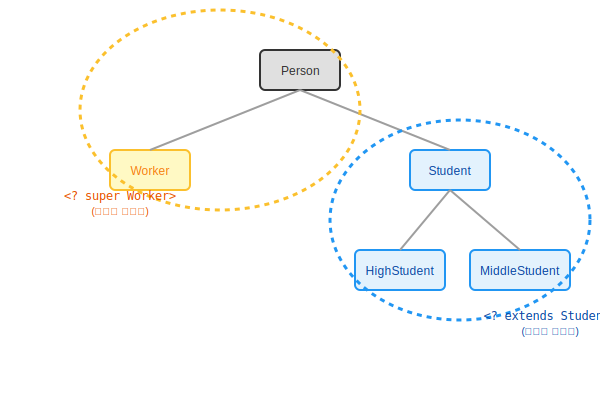

# 16.4 와일드카드 타입 (<?>)


<br>

## 1. 다 받아주거나, 골라서 받거나 🎯

제네릭 타입을 매개변수로 받을 때, **정확히 그 타입(`Box<Integer>`)**만 받아야 한다면 너무 빡빡합니다.
때로는 "학생(Student) 관련된 건 다 받아줘!"라거나 "직장인(Worker) 위로는 다 받아줘!"라고 범위를 지정하고 싶을 때가 있습니다.

이때 사용하는 것이 **와일드카드(`?`)**입니다.



<br>


<br>

## 2. 세 가지 범위

### 1) `<?>` : 모든 타입 가능 (Unbounded)
*   "누구나 오세요!" (`Object`와 같음)
*   **읽기 전용**으로 주로 쓰입니다.

### 2) `<? extends T>` : 상한 제한 (Upper Bounded)
*   **"T와 그 자식들만 오세요."**
*   예시: `<? extends Student>`
    *   `Student` (O), `HighStudent` (O), `MiddleStudent` (O)
    *   `Person` (X), `Worker` (X)
*   주로 **데이터를 꺼내서(Get) 사용할 때** 유용합니다. (안에 든 게 최소한 `Student`임은 확실하니까)

### 3) `<? super T>` : 하한 제한 (Lower Bounded)
*   **"T와 그 부모들만 오세요."**
*   예시: `<? super Worker>`
    *   `Worker` (O), `Person` (O), `Object` (O)
    *   `Student` (X)
*   주로 **데이터를 저장할 때(Set)** 유용합니다. (`Worker`를 담으려면 `Worker` 그릇이나 더 큰 `Person` 그릇이 필요하니까)

<br>


<br>

## 3. 코드 예시

```java
public class Course {
    // 1. 누구나 등록 가능
    public static void registerCourse1(Applicant<?> applicant) { ... }

    // 2. 학생만 등록 가능 (학생 할인 이벤트)
    public static void registerCourse2(Applicant<? extends Student> applicant) { ... }

    // 3. 직장인과 일반인만 등록 가능 (직장인 과정)
    public static void registerCourse3(Applicant<? super Worker> applicant) { ... }
}
```

> **핵심 요약**
> *   **`extends`**: "나랑 내 밑으로 집합!" (소비자, 읽기용)
> *   **`super`**: "나랑 내 위로 집합!" (공급자, 쓰기용)
