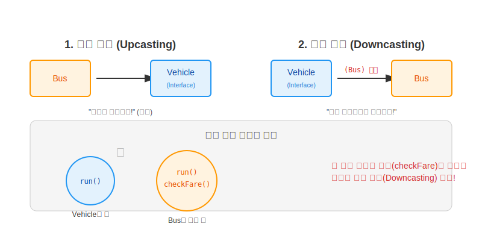

# 11.10 타입 변환 (Casting)

인터페이스의 타입 변환은 객체를 더 넓게 쓰거나(자동), 다시 원래대로 좁게 쓰는(강제) 과정을 말합니다.
**상속 관계에서의 타입 변환**과 원리는 완전히 동일합니다.

### 💡 핵심 비유: 연예인의 사생활
> **"무대 위에서는 모두가 '가수(Interface)'로 불리지만, 집에 돌아가면 누군가는 '철수'이고 누군가는 '영희'이다. 본래의 삶(고유 기능)을 살려면 가면을 벗어야 한다."**



---


<br>

## 1. 자동 타입 변환 (Upcasting)

**구현 객체**는 **인터페이스 타입**으로 자동 변환될 수 있습니다.
왜냐하면 구현 객체는 인터페이스의 모든 기능을 가지고 있기 때문입니다. (Is-A 관계)

```java
// "버스는 탈것(Vehicle)이다." (말이 됩니다!)
Vehicle vehicle = new Bus();
```

### 특징
*   변환된 `vehicle` 변수로는 **`Vehicle` 인터페이스에 정의된 메소드만** 호출할 수 있습니다.
*   `Bus`가 가진 `checkFare()` 같은 고유 기능은 가려져서 보이지 않습니다.


<br>

## 2. 강제 타입 변환 (Downcasting)

자동 변환된 상태에서, **다시 원래의 구현 클래스 타입으로 되돌리는 것**입니다.
이때는 개발자가 **"내가 책임질 테니 바꿔줘!"**라고 강제로 명령(`(Type)`)해야 합니다.

```java
// "이 탈것을 다시 버스로 되돌려라!"
Bus bus = (Bus) vehicle;

// 이제 버스만의 고유 기능을 쓸 수 있다!
bus.checkFare(); 
```

### 왜 할까요?
인터페이스 타입으로 받아온 객체를 사용하다가, **특정 구현 객체만 가지고 있는 고유한 기능**이 급하게 필요할 때 사용합니다.


<br>

## 3. 주의사항 (ClassCastException)

만약 `Bus`가 아닌 `Taxi`를 억지로 `Bus`로 바꾸려고 하면 어떻게 될까요?


---

# 11.10 타입 변환 (Casting)

인터페이스의 타입 변환은 객체를 더 넓게 쓰거나(자동), 다시 원래대로 좁게 쓰는(강제) 과정을 말합니다.
**상속 관계에서의 타입 변환**과 원리는 완전히 동일합니다.

### 💡 핵심 비유: 연예인의 사생활
> **"무대 위에서는 모두가 '가수(Interface)'로 불리지만, 집에 돌아가면 누군가는 '철수'이고 누군가는 '영희'이다. 본래의 삶(고유 기능)을 살려면 가면을 벗어야 한다."**


---


<br>

## 1. 자동 타입 변환 (Upcasting)

**구현 객체**는 **인터페이스 타입**으로 자동 변환될 수 있습니다.
왜냐하면 구현 객체는 인터페이스의 모든 기능을 가지고 있기 때문입니다. (Is-A 관계)

```java
// "버스는 탈것(Vehicle)이다." (말이 됩니다!)
Vehicle vehicle = new Bus();
```

### 특징
*   변환된 `vehicle` 변수로는 **`Vehicle` 인터페이스에 정의된 메소드만** 호출할 수 있습니다.
*   `Bus`가 가진 `checkFare()` 같은 고유 기능은 가려져서 보이지 않습니다.


<br>

## 2. 강제 타입 변환 (Downcasting)

자동 변환된 상태에서, **다시 원래의 구현 클래스 타입으로 되돌리는 것**입니다.
이때는 개발자가 **"내가 책임질 테니 바꿔줘!"**라고 강제로 명령(`(Type)`)해야 합니다.

```java
// "이 탈것을 다시 버스로 되돌려라!"
Bus bus = (Bus) vehicle;

// 이제 버스만의 고유 기능을 쓸 수 있다!
bus.checkFare(); 
```

### 왜 할까요?
인터페이스 타입으로 받아온 객체를 사용하다가, **특정 구현 객체만 가지고 있는 고유한 기능**이 급하게 필요할 때 사용합니다.


<br>

## 3. 주의사항 (ClassCastException)

만약 `Bus`가 아닌 `Taxi`를 억지로 `Bus`로 바꾸려고 하면 어떻게 될까요?


```java
Vehicle vehicle = new Taxi();
Bus bus = (Bus) vehicle; // 에러 발생! (ClassCastException)
```

자바는 실행 도중에 에러를 뿜으며 멈춰버립니다. 마치 **"택시 보고 버스 정류장에 서라는 꼴"**이기 때문입니다.
그래서 강제 변환 전에는 반드시 `instanceof`로 확인하는 절차가 필요합니다. (11.12절 참조)

---

## 코딩 영단어 학습 📝

코딩에서 영어 단어의 의미만 정확히 이해해도 절반은 성공입니다! 오늘 배운 핵심 영단어들을 다시 한번 짚고 넘어가 볼까요?

*   **`Casting`**: 캐스팅, 형변환. (인터페이스 타입과 그것을 구현한 실제 클래스 타입 간에 모습을 부드럽게 바꾸거나 억지로 변환하는 과정)
*   **`Downcasting`**: 다운캐스팅. (인터페이스라는 둥글뭉술한 껍데기(부모)로 가려져 있던 객체를, 다시 본래 클래스가 가진 고유한 기능들까지 몽땅 쓸 수 있도록 구체적인 타입(자식)으로 강제로 끌어내리는 것)
