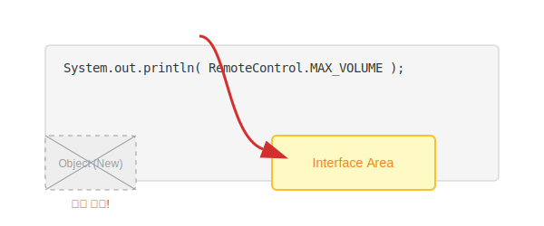

# 11.3 상수 필드 (불변의 법칙)

인터페이스는 객체의 사용 설명서 역할을 하므로, 객체마다 달라지는 데이터(인스턴스 필드)를 가질 수 없습니다.
대신 **어떤 객체든 공통으로 지켜야 할 절대적인 값(상수)**은 가질 수 있습니다.

### 💡 핵심 비유: 헌법과 법률
> **"법전(Interface)에 '성년의 나이는 19세'라고 적혀있다면, 모든 국민(구현 객체)은 이를 따라야 한다. 함부로 20세로 바꿀 수 없다."**


---


<br>

## 1. 숨겨진 제어자 (public static final)

인터페이스에 변수를 선언하면, 개발자가 아무것도 안 적어도 컴파일러가 알아서 **`public static final`**을 붙여줍니다.



```java
public interface RemoteControl {
    
    // [개발자 입력]
    int MAX_VOLUME = 10;
    int MIN_VOLUME = 0;
    
    // [실제 컴파일 된 모습]
    // public static final int MAX_VOLUME = 10;
    // public static final int MIN_VOLUME = 0;
}
```

*   **public**: 누구나 볼 수 있다.
*   **static**: 객체 생성 없이 인터페이스 이름으로 바로 쓴다. (`RemoteControl.MAX_VOLUME`)
*   **final**: 한 번 정해지면 절대 값을 바꿀 수 없다.


<br>

## 2. 반드시 초기값을 줘야 함

`static final` 상수는 선언과 동시에 값을 넣어줘야 합니다. 나중에 생성자에서 값을 넣는 것이 불가능하기 때문입니다.

```java
int MAX_VOLUME;      // (X) 에러! 초기값 필요
int MAX_VOLUME = 30; // (O) 정상
```


<br>

## 3. 사용 예시

구현 클래스(`Television`) 내부에서도 이 상수를 사용하여 로직을 짤 수 있습니다.

```java
// 볼륨을 올릴 때, 최대 볼륨(MAX_VOLUME)을 넘지 못하게 막는다!
@Override
public void setVolume(int volume) {
    if (volume > RemoteControl.MAX_VOLUME) {
        this.volume = RemoteControl.MAX_VOLUME; // 10으로 고정
    } else {
        this.volume = volume;
    }
}
```

이렇게 하면 모든 기기들이 **"최대 볼륨은 10이다"**라는 공통된 규칙을 안전하게 지킬 수 있습니다.
