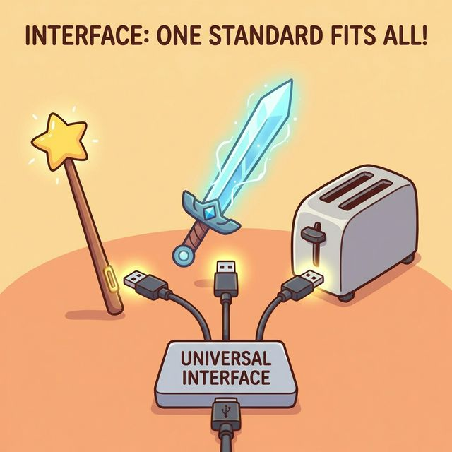
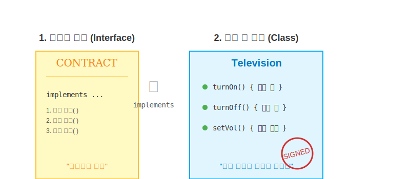
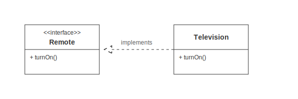

# 11.2 인터페이스와 구현 클래스 선언

인터페이스는 그 자체로는 객체를 만들 수 없습니다. 마치 설계도만으로는 집을 지을 수 없는 것과 같습니다.
반드시 이 설계도를 보고 실제 건물을 짓는 **'구현 클래스'**가 있어야 합니다.

### 💡 핵심 비유: 계약서(Contract)와 서명(Sign)
> **"갑(Interface)이 요구사항을 적은 계약서를 내밀면, 을(Class)은 그 계약서에 서명하고(implements) 모든 조항을 성실히 이행해야 한다."**




---


<br>

## 1. 인터페이스 작성 (계약서 만들기)

`class` 대신 **`interface`** 키워드를 사용합니다.
보통 `.java` 파일로 만들며, 컴파일되면 클래스와 똑같이 `.class` 파일이 생성됩니다.

```java
// RemoteControl.java
package ch11.sec02;

public interface RemoteControl {
    // [계약 조항] 이런 기능들이 있어야 합니다.
    void turnOn();
    void turnOff();
}
```


<br>

## 2. 구현 클래스 작성 (서명하고 이행하기)

해당 인터페이스를 따르겠다고 선언하는 클래스는 **`implements`** 키워드를 사용합니다.
그리고 인터페이스에 정의된 모든 추상 메소드를 빠짐없이 구현(Override)해야 합니다.



```java
// Television.java
package ch11.sec02;

// "나는 RemoteControl 계약을 따르는 TV입니다."
public class Television implements RemoteControl {
    
    // 조항 1 이행
    @Override
    public void turnOn() {
        System.out.println("TV 전원을 켭니다.");
    }
    
    // 조항 2 이행
    @Override
    public void turnOff() {
        System.out.println("TV 전원을 끕니다.");
    }
}
```

*   만약 하나라도 구현하지 않으면? **계약 위반(컴파일 에러)**이 발생합니다.


<br>

## 3. 인터페이스 사용 (User)

사용자(Main)는 구체적인 `Television`의 내부 사정은 몰라도 됩니다.
그저 `RemoteControl` 계약서에 적힌 대로 버튼만 누르면 됩니다.

```java
public class Main {
    public static void main(String[] args) {
        // 1. 변수 선언 (리모컨 준비)
        RemoteControl rc;
        
        // 2. 객체 연결 (TV랑 연결)
        rc = new Television();
        
        // 3. 사용 (전원 켜기)
        rc.turnOn(); // -> TV의 turnOn()이 실행됨
        
        // 4. 교체 (오디오랑 연결)
        rc = new Audio();
        rc.turnOn(); // -> Audio의 turnOn()이 실행됨
    }
}
```

이처럼 `implements`를 통해 클래스들을 **하나의 규격(인터페이스)**으로 묶어주면, 나중에 부품을 갈아 끼우기가 매우 쉬워집니다.

---

## 코딩 영단어 학습 📝

코딩에서 영어 단어의 의미만 정확히 이해해도 절반은 성공입니다! 오늘 배운 핵심 영단어들을 다시 한번 짚고 넘어가 볼까요?

*   **`Declaration`**: 데클러레이션, 선언. (나 앞으로 이런 이름과 모양의 인터페이스나 클래스를 만들어서 쓸 거라고 컴퓨터와 다른 개발자들에게 당당히 알리고 규칙을 정하는 일)
*   **`Contract`**: 컨트랙트, 계약. (인터페이스의 본질적 의미로, '나를 가져다 쓰려면 내 안에 적힌 모든 추상 메소드 조항들을 반드시 구현해야 한다'는 엄격한 약속)
