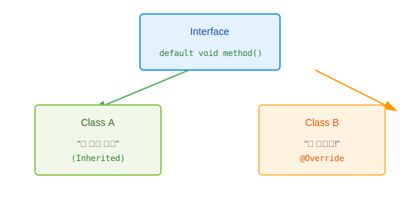

# 11.5 디폴트 메소드 (하위 호환성)

원래 인터페이스는 "추상 메소드"만 가질 수 있었습니다.
하지만 Java 8부터는 **실행 코드를 포함한 "디폴트 메소드(default method)"**를 허용하게 되었습니다.
도대체 왜 갑자기 이런 예외를 둔 것일까요?

### 💡 핵심 비유: 전국 프랜차이즈의 신메뉴 출시
> **"본사(인터페이스)가 신메뉴 레시피(추상 메소드)를 보내면 모든 지점(구현 클래스)이 요리법을 배워야 한다. 하지만 '밀키트(디폴트 메소드)'를 보내주면 지점들은 아무런 노력 없이 바로 신메뉴를 팔 수 있다."**


---


<br>

## 1. 등장 배경 (치명적인 단점 보완)

인터페이스에 새로운 추상 메소드를 하나 추가한다고 가정해 봅시다.
그러면 **이 인터페이스를 사용하던 기존의 모든 클래스들(수십, 수백 개)이 에러가 발생**합니다. 왜냐하면 새로 추가된 메소드를 아직 구현하지 않았기 때문입니다.

> *"기능 하나 추가하려고 전 세계의 모든 구현 클래스를 다 수정해야 한다고? 말도 안 돼!"*

이 문제를 해결하기 위해, **"구현 클래스가 수정하지 않아도 기본적으로 동작하는 메소드"**인 디폴트 메소드가 탄생했습니다.


<br>

## 2. 디폴트 메소드 선언

`default` 키워드를 붙이고, 메소드 `{ 몸체 }`를 작성합니다.

```java
public interface RemoteControl {
    // [기존] 추상 메소드
    void turnOn();
    void turnOff();

    // [New] 디폴트 메소드 (실행 코드가 있다!)
    default void setMute(boolean mute) {
        if (mute) {
            System.out.println("무음 처리합니다.");
        } else {
            System.out.println("무음 해제합니다.");
        }
    }
}
```


<br>

## 3. 구현 클래스의 선택

이제 `RemoteControl`을 구현한 `Television`이나 `Audio`는 `setMute()`를 구현하지 않아도 에러가 나지 않습니다.
인터페이스가 제공해준 코드를 그대로 쓰면 되기 때문입니다.



하지만, **마음에 들지 않으면 바꿀 수도 있습니다(Override).**

```java
public class Audio implements RemoteControl {
    // turnOn, turnOff 구현 ...

    // 디폴트 메소드가 맘에 안 들어서 내 식대로 바꿈
    @Override
    public void setMute(boolean mute) {
        System.out.println("오디오용 무음: 음악 일단 멈춤 기능 추가");
    }
}
```


<br>

## 4. 핵심 요약

1.  **목적**: 기존 인터페이스를 확장할 때, 기존 구현 클래스들이 **깨지지 않게(에러 안 나게)** 하기 위함입니다.
2.  **특징**: `default` 키워드 사용, 실행 블록 `{}` 존재.
3.  **선택**: 구현 클래스는 이를 그대로 써도 되고, 재정의(Override)해도 됩니다.
