# 11.7 인터페이스 상속

인터페이스끼리도 상속이 가능합니다. 특이한 점은 클래스와 달리 **"다중 상속(여러 부모를 두는 것)"을 허용**한다는 것입니다.
상속 키워드는 클래스와 동일하게 `extends`를 사용합니다.

### 💡 핵심 비유: 족보와 유산
> **"할아버지의 재산과 아버지의 재산을 모두 물려받은 손자. 손자는 자신이 번 돈뿐만 아니라 조상님들의 재산까지 모두 관리해야 한다."**



---


<br>

## 1. 인터페이스 다중 상속 문법

```java
public interface InterfaceA {
    void methodA();
}

public interface InterfaceB {
    void methodB();
}

// A와 B를 동시에 상속받은 C
public interface InterfaceC extends InterfaceA, InterfaceB {
    void methodC();
}
```

이제 `InterfaceC`는 자신의 기능인 `methodC()`뿐만 아니라, 부모인 `A`, `B`의 기능까지 모두 합쳐서 총 3개의 추상 메소드를 가지게 됩니다.


<br>

## 2. 구현 클래스의 막중한 의무

`InterfaceC`를 구현(`implements`)하는 클래스는 **C의 메소드뿐만 아니라 A와 B의 메소드까지 전부 다 구현해야 합니다.** 하나라도 빠지면 에러가 납니다.


```java
public class ImplClass implements InterfaceC {
    // 반드시 A, B, C 다 구현해야 함!
    @Override public void methodA() { ... }
    @Override public void methodB() { ... }
    @Override public void methodC() { ... }
}
```


<br>

## 3. 타입 변환의 범위

구현 객체(`ImplClass`)는 자식 인터페이스(`C`)는 물론, 조상 인터페이스(`A`, `B`) 타입으로도 변환될 수 있습니다.

```java
ImplClass impl = new ImplClass();

// InterfaceA 타입으로 변환 -> methodA()만 호출 가능
InterfaceA ia = impl;
---

# 11.7 인터페이스 상속

인터페이스끼리도 상속이 가능합니다. 특이한 점은 클래스와 달리 **"다중 상속(여러 부모를 두는 것)"을 허용**한다는 것입니다.
상속 키워드는 클래스와 동일하게 `extends`를 사용합니다.

### 💡 핵심 비유: 족보와 유산
> **"할아버지의 재산과 아버지의 재산을 모두 물려받은 손자. 손자는 자신이 번 돈뿐만 아니라 조상님들의 재산까지 모두 관리해야 한다."**


---


<br>

## 1. 인터페이스 다중 상속 문법

```java
public interface InterfaceA {
    void methodA();
}

public interface InterfaceB {
    void methodB();
}

// A와 B를 동시에 상속받은 C
public interface InterfaceC extends InterfaceA, InterfaceB {
    void methodC();
}
```

이제 `InterfaceC`는 자신의 기능인 `methodC()`뿐만 아니라, 부모인 `A`, `B`의 기능까지 모두 합쳐서 총 3개의 추상 메소드를 가지게 됩니다.


<br>

## 2. 구현 클래스의 막중한 의무

`InterfaceC`를 구현(`implements`)하는 클래스는 **C의 메소드뿐만 아니라 A와 B의 메소드까지 전부 다 구현해야 합니다.** 하나라도 빠지면 에러가 납니다.


```java
public class ImplClass implements InterfaceC {
    // 반드시 A, B, C 다 구현해야 함!
    @Override public void methodA() { ... }
    @Override public void methodB() { ... }
    @Override public void methodC() { ... }
}
```


<br>

## 3. 타입 변환의 범위

구현 객체(`ImplClass`)는 자식 인터페이스(`C`)는 물론, 조상 인터페이스(`A`, `B`) 타입으로도 변환될 수 있습니다.

```java
ImplClass impl = new ImplClass();

// InterfaceA 타입으로 변환 -> methodA()만 호출 가능
InterfaceA ia = impl;
ia.methodA();

// InterfaceC 타입으로 변환 -> A, B, C 모든 메소드 호출 가능
InterfaceC ic = impl;
ic.methodA();
ic.methodB();
ic.methodC(); // 강력함!
```

---

## 코딩 영단어 학습 📝

코딩에서 영어 단어의 의미만 정확히 이해해도 절반은 성공입니다! 오늘 배운 핵심 영단어들을 다시 한번 짚고 넘어가 볼까요?

*   **`Inheritance`**: 인헤리턴스, 상속. (인터페이스도 클래스처럼 다른 인터페이스의 기능(메소드)들을 그대로 물려받을 수 있는 성질)
*   **`Multiple Inheritance`**: 다중 상속. (클래스는 부모가 하나뿐이지만, 인터페이스는 등 뒤에 여러 명의 강력한 부모 인터페이스를 동시에 두어 그 모든 기능을 몽땅 물려받는 것이 허용되는 특별한 능력)
