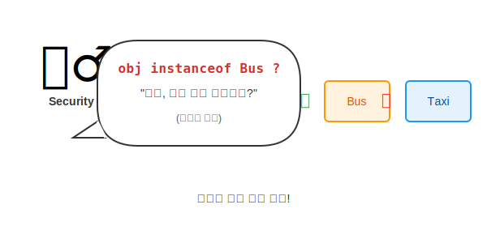

# 11.11 객체 타입 확인 (instanceof)

강제 타입 변환(Downcasting)을 하기 전에, 이 객체가 진짜 내가 생각하는 그 타입이 맞는지 **반드시 확인**해야 합니다.
확인하지 않고 변환했다가는 프로그램이 터질 수 있기 때문입니다. (`ClassCastException` 폭탄!)

### 💡 핵심 비유: 공항 보안 검색 (신분증 검사)
> **"비행기를 태우기 전(Cast), 승객의 여권(instanceof)을 반드시 확인해야 한다. 엉뚱한 사람을 태우면 큰일 난다."**



---


<br>

## 1. 사용법

`instanceof` 연산자는 좌변의 객체가 우변의 타입이면 `true`, 아니면 `false`를 반환합니다.

```java
boolean result = 객체 instanceof 타입;
```

```java
public void ride(Vehicle vehicle) {
    // "혹시... 버스 맞으세요?" 확인
    if (vehicle instanceof Bus) {
        // "아, 버스 맞군요! 그럼 버스로 변환해 드릴게요."
        Bus bus = (Bus) vehicle;
        bus.checkFare(); 
    } else {
        System.out.println("버스가 아닙니다. 요금 확인 불가!");
    }
}
```


<br>

## 2. 처리 흐름도 (Flowchart)

안전한 타입 변환을 위한 정석적인 흐름입니다.




<br>

## 3. Java 12 이후의 개선 (Pattern Matching)

Java 12부터는 `instanceof`와 동시에 변수 선언이 가능해져서 코드가 훨씬 간결해졌습니다.

```java
// [Java 11 이전] 확인 따로, 변환 따로
if (vehicle instanceof Bus) {
    Bus bus = (Bus) vehicle;
    bus.checkFare();
}

// [Java 12 이후] 확인과 동시에 변수 'bus' 생성!
if (vehicle instanceof Bus bus) {
    bus.checkFare(); // 바로 사용 가능
}
```

이 패턴 매칭 기능을 활용하면 지루한 반복 코드를 줄일 수 있습니다.
