# 11.6 다중 인터페이스 구현 (Multi-Role)

자바에서 클래스 상속(`extends`)은 오직 하나만 가능합니다(단일 상속).
하지만 인터페이스 구현(`implements`)은 **개수에 제한이 없습니다.** 이를 **다중 구현**이라고 합니다.

### 💡 핵심 비유: 수륙양용차 (Amphibious Vehicle)
> **"자동차의 기능(Car)과 배의 기능(Boat)을 모두 갖춘 수륙양용차는 땅에서도 달리고, 물에서도 뜬다. 두 가지 역할을 동시에 수행하는 것이다."**



---


<br>

## 1. 다중 구현의 원리

하나의 객체가 여러 개의 인터페이스를 구현하면, 그 객체는 **다양한 타입**으로 불릴 수 있습니다.
마치 한 사람이 회사에서는 '대리님', 집에서는 '아빠', 동호회에서는 '총무님'으로 불리는 것과 같습니다.

### 구조도


```java
public interface Remote {
    void turnOn();
}

public interface Searchable {
    void search(String url);
}

// 콤마(,)로 구분하여 나열
public class SmartTelevision implements Remote, Searchable {
    
    @Override
    public void turnOn() {
        System.out.println("TV 켬");
    }

    @Override
    public void search(String url) {
        System.out.println(url + " 검색");
    }
}
```


<br>

## 2. 사용할 때 주의점

`SmartTelevision` 객체는 `Remote` 타입 변수에도 담길 수 있고, `Searchable` 타입 변수에도 담길 수 있습니다.
단, **어느 변수에 담기느냐에 따라 사용할 수 있는 기능이 제한**됩니다.

```java
SmartTelevision tv = new SmartTelevision();

// 1. Remote 타입으로 사용 -> turnOn()만 가능
Remote rc = tv;
rc.turnOn();
// rc.search("youtube"); // (X) 불가능! 리모컨에는 검색 버튼이 없음

// 2. Searchable 타입으로 사용 -> search()만 가능
Searchable sc = tv;
sc.search("youtube");
// sc.turnOn(); // (X) 불가능! 검색기에는 전원 버튼이 없음
```

즉, **"내가 쓴 가면(인터페이스)에 맞는 행동만 할 수 있다"**는 원칙을 기억하세요!
