# 11.9 다형성 (Polymorphism)

객체지향 프로그래밍의 꽃, **다형성**입니다.
인터페이스를 사용하면 프로그램을 수정하지 않고도 부품(구현 객체)을 자유롭게 교체할 수 있습니다. 이것이 자바가 가진 가장 강력한 무기입니다.

### 💡 핵심 비유: USB 포트와 타이어
> **"컴퓨터의 USB 포트(인터페이스)에는 마우스, 키보드, 카메라 등 무엇이든 꽂을 수 있다. 꽂히는 게 무엇이냐에 따라 컴퓨터의 기능이 확장된다."**



---


<br>

## 1. 필드의 다형성 (부품 교체)

자동차 클래스를 만들 때, 타이어를 `HankookTire`라고 딱 정해놓는 것보다, `Tire` 인터페이스로 선언해두면 나중에 훨씬 유연해집니다.



```java
class Car {
    // 인터페이스 타입으로 선언 (한국타이어든 금호타이어든 다 들어와!)
    Tire frontTire = new HankookTire(); 
    
    void run() {
        frontTire.roll(); // 굴러갑니다.
    }
}
```

나중에 성능이 더 좋은 `MichelinTire`가 나오면?

```java
Car myCar = new Car();
// 코드 수정 없이 타이어만 쏙 교체!
myCar.frontTire = new MichelinTire(); 
```


<br>

## 2. 매개변수의 다형성 (만능 입구)

메소드의 매개변수를 인터페이스 타입으로 선언하면, 그 인터페이스를 구현한 **어떤 객체든지** 매개변수로 받을 수 있습니다.

```java
// 운전자가 운전을 합니다.
void drive(Vehicle vehicle) {
    vehicle.run();
}
```

```java
Driver driver = new Driver();

// 버스 운전
driver.drive(new Bus()); 

// 택시 운전 (메소드 코드는 그대로인데, 동작이 바뀜!)
driver.drive(new Taxi()); 
```

이처럼 **"하나의 코드로 다양한 실행 결과가 나오는 성질"**이 바로 다형성입니다.
