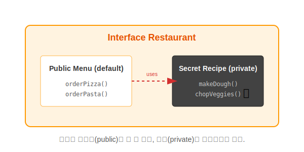

# 11.12 프라이빗 메소드 (비밀 레시피)

Java 9부터는 인터페이스 내부에 **`private` 메소드**를 만들 수 있게 되었습니다.
인터페이스는 원래 "공개(public)"가 원칙이었는데, 왜 굳이 숨겨진 메소드를 허용했을까요?

### 💡 핵심 비유: 식당의 메뉴판과 주방
> **"손님에게 보여주는 메뉴판(public)은 깔끔해야 한다. 복잡한 요리 과정(private)은 주방 안에서만 공유하고, 밖으로 드러내지 않는다."**



---


<br>

## 1. 사용 목적 (코드 중복 제거)

여러 `default` 메소드나 `static` 메소드에서 **공통적으로 반복되는 코드**가 있을 때, 이를 외부로 노출하지 않으면서 재사용하기 위해 사용합니다.

### 🛑 Before (중복 발생)
```java
public interface Service {
    default void methodA() {
        System.out.println("보안 검사 시작"); // 중복!
        System.out.println("로그 기록");      // 중복!
        System.out.println("A 작업 수행");
    }

    default void methodB() {
        System.out.println("보안 검사 시작"); // 중복!
        System.out.println("로그 기록");      // 중복!
        System.out.println("B 작업 수행");
    }
}
```

### ✅ After (Private 메소드로 분리)


```java
public interface Service {
    default void methodA() {
        commonLogic(); // 공통 코드 호출
        System.out.println("A 작업 수행");
    }

    default void methodB() {
        commonLogic(); // 공통 코드 호출
        System.out.println("B 작업 수행");
    }

    // 외부에는 안 보이고, 내부에서만 쓰는 비밀 도우미
    private void commonLogic() {
        System.out.println("보안 검사 시작");
        System.out.println("로그 기록");
    }
}
```


<br>

## 2. 종류

1.  **`private` 메소드**: `default` 메소드에서 호출 가능.
2.  **`private static` 메소드**: `static` 메소드에서 호출 가능. (물론 `default`에서도 호출 가능)

이제 인터페이스 내부 코드도 **"보여줄 것(Signature)"**과 **"감출 것(Implementation Details)"**을 명확히 나눌 수 있게 되었습니다.
