# 11.1 인터페이스의 역할

자바에서 인터페이스(Interface)는 객체의 사용 방법을 정의한 타입입니다.
쉽게 말해 **"객체와 객체가 서로 소통하기 위한 약속(규격)"**이라고 할 수 있습니다.

### 💡 핵심 비유: 만능 리모컨
> **"삼성 TV든 LG TV든 상관없다. '전원 버튼'을 누르면 켜진다는 약속만 지켜라!"**



---


<br>

## 1. 인터페이스(Interface)란?

우리가 리모컨의 전원 버튼을 누를 때, TV 내부 회로가 어떻게 작동하는지 알 필요가 있나요? 없습니다.
그저 **"이 버튼을 누르면 켜진다"**는 사용법만 알면 됩니다.

*   **인터페이스**: 리모컨 (사용 설명서)
*   **구현 객체**: 실제 삼성 TV, LG TV, 오디오 등
*   **사용자**: 리모컨을 사용하는 사람 (Main 메소드)


<br>

## 2. 왜 사용할까? (Why)

1.  **개발 코드를 수정하지 않고 객체를 바꿔 낄 수 있습니다.** (다형성)
    *   `리모컨.켜기()` 코드 하나로 TV도 켜고, 에어컨도 켤 수 있습니다.
2.  **객체 간의 의존성(결합도)을 낮춥니다.**
    *   사용자는 실제 TV가 어떻게 만들어졌는지 몰라도, 리모컨 사용법만 알면 됩니다.


<br>

## 3. 중간 다리 역할

인터페이스는 **개발 코드와 객체 사이의 중계자** 역할을 합니다.
개발 코드가 인터페이스의 메소드를 호출하면, 인터페이스는 알아서 연결된 실제 객체의 메소드를 실행시킵니다.

```java
// 개발자: "전원 켜!" (인터페이스 호출)
RemoteControl rc = new Television();
rc.turnOn(); 

// 실행 결과: "삼성 TV가 켜집니다." (실제로 실행되는 것)
```

이처럼 인터페이스를 통해 다양한 객체를 동일한 사용 방법으로 다룰 수 있는 것이 자바 프로그래밍의 핵심 기술입니다.
