# 11.8 정적 메소드 (유틸리티 기능)

인터페이스에는 "구현 객체가 없어도 쓸 수 있는" **`static` 메소드**도 정의할 수 있습니다. (Java 8부터)
주로 **도우미(Helper) 역할**을 하는 간단한 기능들을 넣을 때 사용합니다.

### 💡 핵심 비유: 공구함 속의 도구
> **"망치나 드라이버(static method)는 굳이 건물을 짓지 않아도, 공구함(Interface)에서 바로 꺼내 쓸 수 있다."**



---


<br>

## 1. 선언과 호출

`static` 키워드를 붙이고, 실행 블록 `{}` 안에 코드를 작성합니다.
호출할 때는 **인터페이스 이름으로 직접** 호출합니다. (객체 생성 X)


```java
public interface RemoteControl {
    
    // 건전지 교환 기능 (모든 리모컨에 공통적으로 쓰이는 유틸리티)
    static void changeBattery() {
        System.out.println("건전지를 교환합니다.");
    }
}
```

```java
public class Main {
    public static void main(String[] args) {
        // 객체 생성 없이 바로 호출!
        RemoteControl.changeBattery();
    }
}
```


<br>

## 2. 주의사항

`static` 메소드는 인터페이스 소속이므로, 이를 구현한 클래스(`Television` 등)에게 상속되지 않습니다.
즉, `tv.changeBattery()` 처럼 **객체 변수로는 호출할 수 없습니다.**

반드시 `RemoteControl.changeBattery()` 처럼 **본래의 이름**을 불러줘야 합니다.
