# Chapter 18. 람다식 (Lambda Expressions)

> **"코드를 짧고 간결하게 줄여쓰는 마법의 문법"**

 

## 학습목표

1.  **람다식의 기본 문법**: 복잡한 익명 클래스를 화살표(`->`) 하나로 줄이는 법을 배웁니다.
2.  **함수형 인터페이스**: 람다식을 사용할 수 있는 조건(추상 메소드가 하나인 인터페이스)을 이해합니다.
3.  **메소드 참조**: 이미 있는 메소드를 재사용해서 더 짧게 쓰는 법을 배웁니다.
4.  **생성자 참조**: 객체 생성을 더 간단하게 하는 법을 배웁니다.

---

 

## 목차

### [18.1 람다식이란?](./intro)
함수형 프로그래밍과 자바의 람다식 개념을 이해합니다.

### [18.2 매개변수가 없는 람다식](./no-parameter)
가장 단순한 형태의 람다식 문법을 배웁니다. `() -> { ... }`

### [18.3 매개변수가 있는 람다식](./parameter)
매개변수를 받아 처리하는 람다식을 배웁니다. `(x) -> { ... }`

### [18.4 리턴값이 있는 람다식](./return)
결과를 반환하는 람다식을 배웁니다. `(x, y) -> x + y`

### [18.5 메소드 참조](./method-reference)
람다식을 더 줄여서 `Class::method` 형태로 사용하는 방법을 배웁니다.

### [18.6 생성자 참조](./constructor-reference)
객체 생성을 `Class::new` 형태로 사용하는 방법을 배웁니다.

---

 

## 확인문제
- [확인문제](./quiz)
