# 13.7 집합 모듈 (Aggregator Module)


<br>

## 1. 종합 선물 세트 🎁

명절에 스팸, 참치, 식용유를 각각 따로 사서 포장하려면 번거롭습니다.
그래서 우리는 **"종합 선물 세트"**를 하나 삽니다. 이 상자 안에는 스팸, 참치, 식용유가 다 들어있죠.

모듈 시스템에서도 마찬가지입니다.
`Module A`, `Module B`, `Module C`... 수십 개의 모듈을 일일이 `requires` 하려면 기술자가 너무 지저분해집니다.
이때, 이들을 묶어주는 **집합 모듈(Aggregator)**을 하나 만들어서 그것만 `requires` 하면 됩니다.



*   **특징**: 집합 모듈은 **자신만의 코드는 거의 없고(빈 껍데기)**, 오직 `requires transitive`만 잔뜩 가지고 있습니다.
*   **대표 예시**: 자바의 `java.se` 모듈. (이것만 부르면 자바의 핵심 기능을 다 쓸 수 있습니다.)

<br>


<br>

## 2. 만들기 (빈 껍데기 + transitive)

집합 모듈 `my_module`을 만들어 봅시다. 이 모듈은 A와 B를 포함합니다.

```java
// my_module/module-info.java
module my_module {
    // 나는 아무것도 안 하지만, 나를 부르면 얘네들을 다 줍니다.
    requires transitive my_module_a;
    requires transitive my_module_b;
}
```

이제 애플리케이션에서는 `my_module` 하나만 부르면 해결됩니다.

```java
// my_application/module-info.java
module my_application {
    // A, B를 따로 적을 필요 없이 이거 하나면 끝!
    requires my_module;
}
```

> **핵심 요약**: 집합 모듈은 여러 모듈을 그룹핑해주는 **"편리한 바로가기 링크"** 같은 존재입니다.
