# 13.1 라이브러리 (Library)


<br>

## 1. 개발자의 공구함 (Toolbox) 🧰

자동차를 만들 때 나사, 망치, 엔진, 바퀴 등 모든 부품을 직접 쇠를 깎아서 만들까요? 아니죠.
이미 전문 회사가 잘 만들어놓은 부품을 사와서 조립하는 것이 훨씬 효율적입니다.

프로그래밍도 마찬가지입니다.
**라이브러리(Library)**는 다른 개발자들이 미리 만들어둔 **"유용한 클래스와 인터페이스의 모음(공구함)"**입니다.



*   **JAR 파일**: 자바에서는 이 공구함을 **JAR(Java ARchive)**라는 파일 형식으로 제공합니다.
*   **사용법**: 프로젝트에 이 JAR 파일을 추가(Build Path)하면, 그 안에 들어있는 클래스들을 내 것처럼 `import` 해서 쓸 수 있습니다.

<br>


<br>

## 2. JAR 파일의 정체 (압축 파일)

JAR 파일은 거창한 것이 아닙니다. 우리가 흔히 쓰는 **ZIP 압축 파일**과 똑같습니다.
여러 패키지와 클래스 파일(`.class`)들을 폴더 구조 그대로 하나의 파일로 묶어놓은 것입니다.


> **팁**: `.jar` 파일의 확장자를 `.zip`으로 바꾸고 압축을 풀어보세요. 안에 수많은 `.class` 파일들이 들어있는 것을 볼 수 있습니다!

<br>


<br>

## 3. 라이브러리 사용하기 (실습)

이클립스나 IDE에서 외부 라이브러리를 가져와서 쓰는 방법을 알아봅시다.
크게 두 가지 단계가 필요합니다.

1.  **JAR 파일 구하기**: 인터넷에서 다운로드하거나 직접 만듭니다.
2.  **Build Path에 추가하기**: "이 프로젝트에서 저 공구함을 쓰겠다"고 IDE에게 알려줍니다.

### 💻 명령어로 실행할 때 (ClassPath)
만약 IDE 없이 터미널에서 실행한다면, `-classpath` (또는 `-cp`) 옵션으로 라이브러리 위치를 알려줘야 합니다.

```bash
# 윈도우 (구분자 ;)
java -cp .;my_lib.jar MyApp

# 맥/리눅스 (구분자 :)
java -cp .:my_lib.jar MyApp
```
*   `.` (점): 현재 내 위치에서도 클래스를 찾아라.
*   `my_lib.jar`: 저 라이브러리 안에서도 클래스를 찾아라.

> **핵심 요약**: 프로그래밍은 **"바퀴를 다시 발명하지 않는 것"**부터 시작합니다. 좋은 라이브러리(JAR)를 찾아서 내 프로젝트에 연결(Build Path)하는 것이 바로 능력입니다!
