# 13.4 모듈 배포용 JAR 파일


<br>

## 1. 명세서가 붙은 택배 박스 📦

우리가 만든 모듈을 다른 사람에게 주려면 어떻게 해야 할까요?
당연히 하나의 파일로 포장(JAR)해서 줘야 합니다.

이때, **모듈 배포용 JAR**는 일반 JAR와 한 가지 결정적인 차이가 있습니다.
바로 **'박스 겉면에 상세한 명세서(`module-info.class`)가 붙어있다'**는 점입니다.



*   **일반 JAR**: 그냥 열어보기 전엔 뭐가 들었는지, 뭘 조심해야 하는지 모릅니다.
*   **모듈 JAR**: "이 박스엔 폭발물이 없으며(보안), 취급 시 장갑이 필요함(의존성)" 같은 정보가 `module-info`에 적혀있습니다.

<br>


<br>

## 2. JAR 파일 만들기 (Export)

이클립스에서는 아주 쉽게 모듈을 JAR로 만들 수 있습니다.

1.  **프로젝트 우클릭** -> **Export** -> **Java / JAR file** 선택.
2.  **`src` 폴더 체크**: 소스 코드와 `module-info.java`가 포함되어야 합니다.
3.  **경로 지정**: 보통 `dist`(distribution) 폴더를 만들어 저장합니다.

이렇게 만든 `.jar` 파일 안에는 컴파일된 `module-info.class` 파일이 루트에 포함됩니다.
이것이 바로 모듈의 **신분증**입니다.

<br>


<br>

## 3. 다른 프로젝트에서 가져다 쓰기

이제 `my_application` 프로젝트에서 이 JAR 파일을 써봅시다.

### Build Path 설정
1.  **Project 우클릭** -> **Build Path** -> **Configure Build Path**.
2.  **Libraries 탭** -> **Modulepath** 선택 (중요!).
    *   *Classpath*가 아니라 *Modulepath*에 추가해야 모듈로 인식됩니다.
3.  **Add External JARs** -> 방금 만든 JAR 파일 선택.

### module-info.java 작성
마지막으로, "나 이 모듈 쓸 거야"라고 선언해야 합니다.

```java
module my_application {
    requires my_module_a; // JAR 파일 안에 적힌 모듈 이름
}
```

> **핵심 요약**: 모듈을 JAR로 만들면, 그 자체로 **완벽한 자기 설명서(`module-info`)**를 가진 독립적인 부품이 됩니다.
