# 13.2 모듈 (Module)

 

## 1. 패키지보다 더 큰 상자 (Shipping Container)

Java 9 이전까지는 자바의 가장 큰 정리가 "패키지(Package)"였습니다.
하지만 프로그램이 거대해지면서 패키지만으로는 관리가 힘들어졌습니다. 마치 **수천 개의 택배 박스가 창고에 널려있는 상황**과 같았죠.

그래서 등장한 것이 **모듈(Module)**입니다. 모듈은 **"여러 패키지를 담는 배송용 컨테이너"**와 같습니다.

*   **구조**: `클래스` < `패키지` < `모듈`
*   **역할**: 관련된 패키지들을 하나로 묶고, **외부에 공개할 것과 숨길 것**을 철저히 관리합니다.

 

 

## 2. 모듈 기술자 (Manifest)

모듈을 만들 때는 **"이 컨테이너에 무엇이 들어있고, 어디로 보낼 것인가"**를 적은 문서가 필요합니다.
이것이 바로 `module-info.java` 파일(모듈 기술자)입니다. 프로젝트의 최상위 폴더(`src`)에 위치합니다.

*   **`exports`**: "이 패키지는 밖에서 써도 됩니다." (수출/공개)
*   **`requires`**: "이 모듈을 실행하려면 저 모듈이 필요합니다." (수입/의존성)

### 기존 라이브러리(JAR)와의 결정적 차이
예전 라이브러리(JAR)는 그냥 클래스들을 뭉쳐놓은 것이라, 내부의 모든 클래스에 접근할 수 있었습니다(보안 취약).
하지만 모듈은 **`exports` 하지 않은 패키지는 절대 외부에서 접근할 수 없습니다.** (강력한 캡슐화)

 

 

## 3. 왜 쓸까요?
1.  **보안성**: 내부 구현용 패키지를 완벽하게 숨길 수 있습니다.
2.  **경량화**: 필요한 모듈만 조립해서 쓸 수 있어서 메모리를 절약할 수 있습니다 (IoT 기기 등에 유리).
3.  **의존성 관리**: "A를 쓰려면 B가 필요하다"는 사실을 컴파일 단계에서 바로 알 수 있습니다.

> **핵심 요약**: 모듈은 **자바의 대규모 이사짐(패키지) 관리 시스템**입니다. `module-info.java`라는 명세서를 통해 주고받을 짐을 명확히 합니다.
