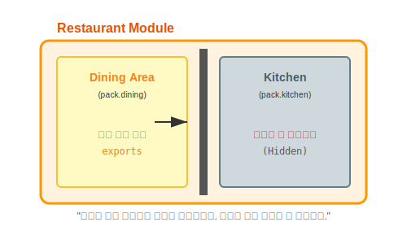

# 13.5 패키지 은닉 (Package Hiding)


<br>

## 1. 관계자 외 출입금지 ⛔

식당에 가면 손님이 밥을 먹는 **'홀(Hall)'**은 누구나 들어갈 수 있지만, 요리를 만드는 **'주방(Kitchen)'**은 아무나 들어갈 수 없습니다.
모듈도 마찬가지입니다.



*   **`exports` 한 패키지**: 식당의 **홀**. 외부 모듈이 `import` 해서 쓸 수 있습니다.
*   **`exports` 안 한 패키지**: 식당의 **주방**. 외부에서는 절대 접근할 수 없습니다(심지어 클래스가 `public`이어도!).

<br>


<br>

## 2. 왜 숨길까요? (캡슐화의 완성)
만약 주방에 손님이 마음대로 들어와서 소금통을 휘젓는다면 요리 맛이 엉망이 되겠죠?
프로그램도 **내부 구현용 클래스(주방)**를 외부에 노출하면, 누군가 그걸 잘못 써서 프로그램이 고장 날 수 있습니다.

**모듈 시스템**은 `exports` 키워드를 통해 **"보여주고 싶은 것만 보여주는"** 강력한 보안 기능을 제공합니다.

<br>


<br>

## 3. 실습: 주방 숨기기

`my_module_a`에는 두 개의 패키지가 있습니다.
*   `pack1` (공개용)
*   `pack2` (내부 구현용 - 은닉)

`module-info.java`에서 `pack2`를 지워버리면 은닉됩니다.

```java
module my_module_a {
    exports pack1; // 공개!
    // exports pack2; -> 주석 처리하면 은닉됨 (숨김)
}
```

이제 외부(`my_application`)에서 `pack2`의 클래스를 쓰려고 하면 컴파일 에러가 납니다.

```java
import pack1.A; // OK
import pack2.B; // Error! "The type pack2.B is not accessible"
```

> **핵심 요약**: 모듈은 **"보여줄 것(`exports`)"**을 명시하지 않으면 모두 **비공개**가 원칙입니다. 보안성이 뛰어납니다!

---

## 코딩 영단어 학습 📝

코딩에서 영어 단어의 의미만 정확히 이해해도 절반은 성공입니다! 오늘 배운 핵심 영단어들을 다시 한번 짚고 넘어가 볼까요?

*   **`Hiding`**: 하이딩, 은닉. (모듈 안의 중요한 패키지(예: 내부 처리용 로직)를 외부에서 접근하지 못하도록 숨겨두는 캡슐화 기법)
*   **`Encapsulation`**: 인캡슐레이션, 캡슐화. (알약 캡슐처럼 데이터나 내부 로직을 꽁꽁 감싸서 외부의 직접적인 조작을 막고 안전하게 보호하는 객체지향의 핵심 원리)
