# 13.8 리플렉션 허용 (Reflection & Opens)


<br>

## 1. 엑스레이 검사 (X-Ray) 🦴

공항 보안 검색대에 가면 가방을 열지 않고도(은닉), 엑스레이를 통해 내용물을 훤히 들여다볼 수 있습니다.
자바의 **리플렉션(Reflection)**이 바로 이 엑스레이와 같습니다. 실행 중에 객체의 내부 구조(필드, 메소드 등)를 뜯어보는 기술입니다.

하지만 모듈 시스템은 보안이 철저해서, **기본적으로 엑스레이(리플렉션)도 차단**합니다.
따라서 "내 가방은 엑스레이 찍어도 됩니다"라고 허락해줘야 하는데, 이때 사용하는 키워드가 **`opens`**입니다.



*   **`exports`**: 가방을 활짝 열어주는 것 (정상적인 사용).
*   **`opens`**: 가방은 잠겨있지만, **엑스레이(리플렉션) 검사는 허용**하는 것.

<br>


<br>

## 2. 사용 방법 (opens)

모듈 기술자에서 설정할 수 있습니다.

### 1) 모듈 전체 개방 (투명 가방)
모듈 내의 모든 패키지에 대해 리플렉션을 허용합니다.
```java
open module my_module {
    // 모든 패키지가 리플렉션 가능!
}
```

### 2) 특정 패키지 개방 (주머니만 허용)
지정한 패키지만 리플렉션을 허용합니다.
```java
module my_module {
    // pack1은 리플렉션 가능
    opens pack1; 
    
    // pack2는 특정 외부 모듈(admin)에게만 허용
    opens pack2 to admin_module;
}
```

<br>


<br>

## 3. 왜 쓸까요?
주로 **스프링(Spring) 프레임워크**나 **JPA** 같은 라이브러리들이 이 기능을 필요로 합니다.
이런 라이브러리들은 개발자가 만든 객체를 대신 생성하거나 관리해주기 위해, 내부를 들여다볼 권한(리플렉션)이 필요하기 때문입니다.

> **핵심 요약**: `opens`는 **"런타임 검사(리플렉션)를 위한 뒷문"**을 열어주는 것입니다. 일반적인 코딩에서는 `exports`를 쓰고, 프레임워크를 쓸 때 `opens`를 씁니다.
