# 13.9 자바 표준 모듈 (Standard Modules)

 

## 1. 자바의 뿌리(Root), java.base 🌱

자바 JDK를 설치하면 수많은 기능이 따라옵니다. 이들도 모두 모듈화되어 있습니다.
그중에서 **가장 핵심이 되는 뿌리 모듈**이 바로 `java.base`입니다.

*   **`java.base`**: `java.lang`, `java.util`, `java.io` 등 자바 프로그래밍의 기초가 되는 패키지들이 들어있습니다.
*   **특징**: 모든 자바 모듈은 암묵적으로 `requires java.base;`를 하고 있습니다. (그래서 우리가 `String`이나 `System`을 `import` 없이도 쓸 수 있는 것입니다.)

 

 

## 2. 주요 표준 모듈들

JDK에는 수십 개의 표준 모듈이 있습니다. 필요한 것만 골라 쓰면 됩니다.

*   **`java.desktop`**: AWT, Swing 등 GUI 프로그래밍용.
*   **`java.sql`**: JDBC 등 데이터베이스 연결용.
*   **`java.xml`**: XML 파싱용.
*   **`java.se`**: 위의 표준 모듈들을 몽땅 포함하는 **집합 모듈**. (이거 하나면 다 됩니다.)

 

 

## 3. 왜 이렇게 쪼개놨나요? (Jlink & 경량화)

예전에는 "Hello World" 하나만 찍으려고 해도 거대한 JRE(Java Runtime Environment) 전체가 필요했습니다.
하지만 모듈화가 된 이후에는, **내가 짠 프로그램에 딱 필요한 모듈만 추려서 아주 작은 JRE를 만들 수 있습니다.**

이 기술을 **`jlink`**라고 합니다. 이를 이용하면 사물인터넷(IoT) 기기나 클라우드 컨테이너처럼 용량이 중요한 환경에서 자바를 훨씬 가볍게 돌릴 수 있습니다.

> **핵심 요약**: `java.base`는 산소와 같습니다. 언제나 곁에 있습니다. 그 외의 기능(SQL, GUI 등)은 필요할 때만 `requires` 해서 쓰면 됩니다.
