# 13.6 전이 의존 (Transitive Dependency)


<br>

## 1. 징검다리 놓기 (Bridge) 🌉

우리가 `Module A`를 사용합니다. 그런데 `Module A`가 내부적으로 `Module B`를 쓰고 있습니다.
기본적으로는 `A`만 내 친구이고, `B`는 모르는 사이(접근 불가)입니다.

하지만 `A`가 **"B는 내 절친이니까, 나랑 친구면 B랑도 친구 해!"**라고 소개해줄 수 있습니다.
이것이 바로 **전이 의존 (`requires transitive`)**입니다.



*   **일반 의존 (`requires`)**: A가 B를 씀. (App은 B를 모름)
*   **전이 의존 (`requires transitive`)**: A가 B를 쓰고, **A를 쓰는 녀석(App)에게 B도 쓰게 해줌.**

<br>


<br>

## 2. 왜 쓸까요? (편리함)
생각해보세요. 자바의 `java.desktop` 모듈을 쓰려면, 그 안에 있는 그래픽 관련 모듈(`java.xml` 등)도 다 불라와야 한다면 얼마나 귀찮을까요?
`java.desktop` 하나만 `requires` 하면 관련된 것들이 줄줄이 비엔나처럼 따라오게 만들 때 사용합니다.

<br>


<br>

## 3. 실습: A를 통해 B 쓰기

### 상황 설정
*   `my_application` -> `my_module_a` (requires)
*   `my_module_a` -> `my_module_b` (requires **transitive**)

### 코드 작성
`my_module_a`의 기술자에 `transitive`를 붙입니다.

```java
// my_module_a/module-info.java
module my_module_a {
    exports pack1;
    requires transitive my_module_b; // "나를 부르면 b도 같이 줍니다"
}
```

이제 애플리케이션에서는 `my_module_a`만 불렀지만, `my_module_b`의 클래스도 맘껏 쓸 수 있습니다.

```java
// my_application/Main.java
import pack1.A; // module a
import pack3.C; // module b (자동으로 사용 가능!)

public class Main {
    public static void main(String[] args) {
        // A는 당연히 되고
        A a = new A();
        
        // B 모듈의 C도 사용 가능!
        C c = new C(); 
    }
}
```

> **핵심 요약**: `transitive`는 **"남에게 내 친구(의존 모듈)를 소개해주는 키워드"**입니다.
