# 12.5 바깥 멤버 접근 (this vs Outer.this)


<br>

## 1. 이름이 똑같을 때 (나와 아빠의 차)

중첩 클래스 안에서 `this`를 쓰면 누구를 가리킬까요?
그리고 바깥 클래스의 멤버는 어떻게 부를까요?

**"우리 집(A) 차"**와 **"내(B) 차"**를 구분하는 것과 같습니다.



*   **`this.field`**: **나(중첩 클래스 B)**의 필드를 의미합니다.
*   **`바깥클래스.this.field`**: **바깥(A)**의 필드를 의미합니다.

> 만약 이름이 겹치지 않는다면 그냥 `field`라고 써도 내 것, 바깥 것을 다 찾을 수 있습니다. 하지만 이름이 똑같으면 **명시적으로** 누구  것인지 밝혀야 합니다.

<br>


<br>

## 2. 접근 문법 (Outer.this)

중첩 클래스 내부에서 바깥 클래스의 객체 참조를 얻으려면 **`바깥클래스이름.this`**를 사용합니다.

```java
public class A {
    String field = "바깥쪽 필드(A)";
    
    class B {
        String field = "안쪽 필드(B)";
        
        void print() {
            // 1. 내 것 접근 (B)
            System.out.println(this.field);      // "안쪽 필드(B)"
            
            // 2. 바깥 것 접근 (A)
            System.out.println(A.this.field);    // "바깥쪽 필드(A)"
        }
    }
}
```

<br>


<br>

## 3. 예제 코드로 확인하기

### 💻 예제 코드

```java
public class Outer {
    // 바깥쪽 필드/메소드
    String title = "Outer Class";
    void run() { System.out.println("Outer Run"); }
    
    class Inner {
        // 안쪽 필드/메소드 (이름 동일)
        String title = "Inner Class";
        void run() { System.out.println("Inner Run"); }
        
        void test() {
            // 1. 내 것 호출
            System.out.println("--- 내 것(Inner) ---");
            System.out.println(this.title);
            this.run();
            
            // 2. 바깥 것 호출
            System.out.println("--- 바깥 것(Outer) ---");
            System.out.println(Outer.this.title); // 핵심!
            Outer.this.run();     // 핵심!
        }
    }
    
    void createInner() {
        Inner inner = new Inner();
        inner.test();
    }
    
    public static void main(String[] args) {
        Outer outer = new Outer();
        outer.createInner();
    }
}
```

### 📋 실행 결과
```
--- 내 것(Inner) ---
Inner Class
Inner Run
--- 바깥 것(Outer) ---
Outer Class
Outer Run
```

> **핵심 요약**: 중첩 클래스 안에서 바깥 '인스턴스'가 필요할 땐 **`클래스명.this`** 공식을 기억하세요!
